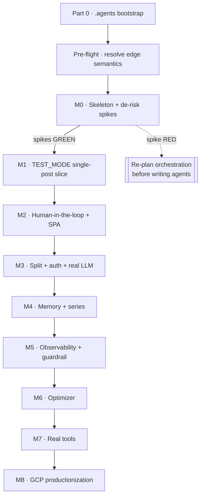
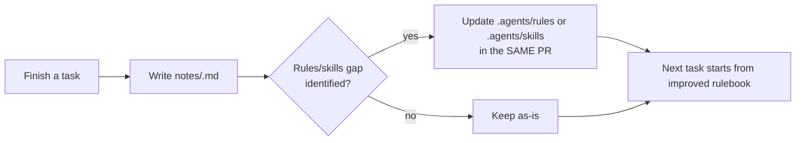
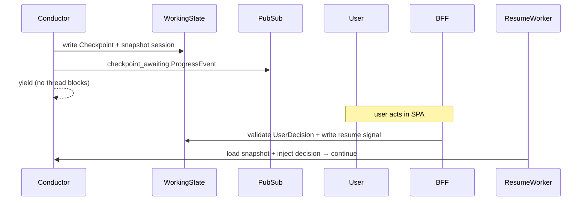

# Implementation Plan — Multi-Agent Blogging Harness

**Companion to:** `PDD.md` (Design baseline v1.2). This document is the **executable runbook**; the PDD is the **design authority**. Where this plan adds a decision the PDD left open (e.g. the fake-LLM fixture schema, §M1), it is marked **[PLAN-DECISION]** and should be back-ported into the PDD once confirmed.

**How to read a task.** Every task has the shape:

> **T-x.y — Title** · _satisfies:_ PDD §refs · _depends on:_ T-a.b
> What to do → concrete commands/snippets → **Gate:** the condition that proves it done (usually a §13 eval tier) → **Closeout:** write the task note (see Standing Discipline).

**Golden rule (from PDD §16):** at every step, keep `TEST_MODE` (§2.4, §9.5) green before wiring any GCP runtime path. A red Tier-0 is a stop-the-line event.

**No task is "done" without its closeout note** (see *Standing Discipline — per-task closeout*). The note is part of the task, not optional paperwork — it is the mechanism by which `.agents/rules` and `.agents/skills` improve so the next task doesn't repeat this one's mistakes.

---

## 0. Critical path at a glance



**Sequencing principle.** M0's three spikes are gates, not chores — the escalate-propagation spike (§4.6 caveat) is the single highest-risk unknown in the whole system. Do **not** start M1 orchestration until it is green or a scoped workaround is proven.

---

## Part 0 — Orientation + `.agents/` bootstrap (do this first, before any design or code)

**Why first.** The PDD's DRY discipline (§14) and "uniform, not bespoke" instrumentation (§11.1) only hold if every contributor — human or agent — shares one rulebook AND one map of the codebase. This part produces both: `AGENTS.md` (the map — *where to look*) and `.agents/` (the rulebook — *how to build*). Together they are the substitution seam for *consistency*, the way `TEST_MODE` is the seam for *determinism*.

### T-0.0 — Author `AGENTS.md` (root entry point) — the first file an agent reads

A short, high-signal orientation file at the repo root. Its job is **navigation and core-architecture recall**, not restating the PDD. Any agent (or human) opening the repo reads this first and knows where to go next.

```markdown
# AGENTS.md — start here

## What this is (one paragraph)
An autonomous, human-in-the-loop pipeline that turns a plain-text idea into a
media-rich, SEO-optimized blog (single post or series), produced by 11 specialist
agents orchestrated by one Conductor, mediated by one Manager, on Google ADK + GCP.

## The 5 invariants you must never break (full list: .agents/rules/00)
1. Bounded refinement — every loop is a LoopAgent with max_iterations. (PDD §1.2.1)
2. Structured everything — every hop is a §7 envelope; exits read typed fields. (§1.2.2)
3. Centralized mediation — specialists never call each other; only the Conductor. (§1.2.3/§2.3.1)
4. Contracts are shared — import blog_contracts; never redefine a schema. (§2.3.2)
5. No env branching in app/agent code — differences live only in DI wiring. (§2.4)

## Core architecture map
Conductor (ADK SequentialAgent of Loop/Parallel blocks)  →  11 specialists
Manager = callbacks on every node (guardrail + log + tool-cache), NOT a proxy (§6.2)
Optimizer = offline job over the episodic log (§8)
Two-node build: tool-using specialist = worker(tools)→structurer(output_schema) (§3)
Loop exit = deterministic BaseAgent checker sets escalate; LoopAgent has no predicate (§4.4/§4.6)

## Where to look
| Need | Go to |
|---|---|
| Design authority (the "why") | PDD.md |
| Build runbook (the "how/when") | IMPLEMENTATION_PLAN.md |
| Always-on invariants | .agents/rules/ |
| Repeatable procedures | .agents/skills/ |
| What was built + lessons per task | notes/ (chronological, one file per task) |
| Contracts (single source of truth) | packages/blog_contracts/ |

## Build & test
make dev | make test-mode | make eval-tier0    (full list: IMPLEMENTATION_PLAN.md Appendix A)

## The one rule that keeps everything working
Keep TEST_MODE green before wiring any GCP path. No task ships without its notes/ closeout note.
```

**Gate:** `AGENTS.md` exists at repo root, links resolve, and it is referenced from the project `CLAUDE.md` so tooling loads it. Keep it ≤1 screen — it is an index, not a spec.

### T-0.1 — Create the `.agents/` tree

```
.agents/
  README.md                        # how rules/skills load + enforcement expectations
  rules/                           # always-on invariants (each ≤1 screen, imperative, testable)
    00-architecture-invariants.md
    01-python-uv-workspace.md
    02-adk-agent-patterns.md
    03-contracts-first.md
    04-ports-and-di.md
    05-observability-mandatory.md
    06-testing-and-evals.md
    07-manager-guardrail.md
    08-naming-style-commits.md
  skills/                          # repeatable step-by-step procedures
    scaffolding_specialists/SKILL.md
    adding_or_changing_contracts/SKILL.md
    adding_loop_exit_checkers/SKILL.md
    adding_eval_cases/SKILL.md
    running_testmode_pipeline/SKILL.md
```

### T-0.2 — Author the rules

Each rule file states the invariant, the reason (PDD ref), and a **check** (how a reviewer/CI verifies it). Illustrative content for the two highest-leverage rules:

**`rules/00-architecture-invariants.md`** (from §1.2 non-negotiables + §2.3):

```markdown
# Architecture invariants (non-negotiable)
1. BOUNDED REFINEMENT — every agent-to-agent loop is an ADK `LoopAgent` with an explicit
   `max_iterations`. No `while True`, no unbounded recursion. (§1.2.1)
   CHECK: grep for LoopAgent → every instance passes max_iterations; no hand-rolled agent loops.
2. STRUCTURED EVERYTHING — every hop is a §7 envelope; loop exits read typed fields
   (`approved`, `position_shift`), never free-text. (§1.2.2)
   CHECK: no exit checker parses model prose; all read Pydantic fields.
3. CENTRALIZED MEDIATION — leaf specialists never import or call each other. Only the
   Conductor dispatches. (§1.2.3, §2.3.1)
   CHECK: import-linter contract — `services.specialists.*` may not import each other.
4. CONTRACTS ARE SHARED — no service redefines a payload schema; all import `blog_contracts`. (§2.3.2)
5. CONDUCTOR IS STATELESS between requests except via the Working-State store. (§2.3.3)
6. NO ENV BRANCHING in app/agent code — environment differences live only in DI wiring. (§2.4)
```

**`rules/02-adk-agent-patterns.md`** (from §3, §4.4, §4.6):

```markdown
# ADK agent patterns
- TOOL-USING specialist = two-node worker→structurer `SequentialAgent` (§3). `output_schema`
  lives on the STRUCTURER only; the worker carries tools and NO `output_schema`.
- TOOL-FREE specialist (Synthesizer) = single `output_schema` node.
- One logical specialist = one Agent Card, one §7 envelope/hop (payload = structurer output),
  one row in the §9.1 "11 specialists". The internal split is invisible to Conductor/Manager.
- LOOP EXIT: `LoopAgent` has NO predicate hook. Exit = a deterministic `BaseAgent` checker,
  appended as the LAST sub-agent inside the LoopAgent, sets `ctx.actions.escalate = True`. NO model call. (§4.4/§4.6)
- Escalate must exit the loop WITHOUT halting the parent SequentialAgent — see M0 spike T-M0.5. (§4.6 caveat)
```

Remaining rules (author to the same shape):
- `01-python-uv-workspace.md` — `uv` workspace members, import direction, each specialist owns its `pyproject.toml`/`uv.lock` (§14).
- `03-contracts-first.md` — `blog_contracts` single source; bump `schema_version` on any breaking change; Manager rejects unknown versions (§6.6).
- `04-ports-and-di.md` — one GCP adapter + one `TEST_MODE` fake per port; DI factory is the only place env is read (§2.4 table).
- `05-observability-mandatory.md` — every agent installs `blog_observability`; full correlation ID set (§11.2); uninstrumented = deploy-blocker (§11.9).
- `06-testing-and-evals.md` — `TEST_MODE` stays green; deterministic-first; Tier-0 every commit (§13.6).
- `07-manager-guardrail.md` — flag+log below high-confidence; strip only high-confidence **structural** injection; never strip reader-facing quoted text (O-6, §6.3).
- `08-naming-style-commits.md` — formatting (ruff), naming, conventional commits, PR must cite PDD §.

### T-0.3 — Author the skills

Skills are the "how", turned into copy-paste procedures. Highest-value one, illustrative:

**`skills/scaffolding_specialists/SKILL.md`**

```markdown
# Scaffold a new specialist
1. `cd services/specialists && agents-cli create <name>`   # single-agent-per-project (§14)
2. Add `<name>` to the root uv workspace members in /pyproject.toml
3. In app/agent.py, DECLARE only: instruction(s), output_schema (a blog_contracts model),
   tool list, input contract. Do NOT hand-roll auth/observability/serving. (§14 DRY rule)
4. Wrap via blog_agent_kit.build(): expands tool-using specialists into the two-node
   worker→structurer unit (§3), installs observability + auth + output_schema binding.
5. Add tests/eval/ dataset (EvalCase + fake-LLM fixture — see skill adding-eval-cases).
6. Gate: `make test-mode` green; schema-conformance eval passes for this agent.
```

Author the rest analogously: `adding-or-changing-contracts` (edit model → bump version → update fixtures/evals), `adding-loop-exit-checkers` (deterministic `BaseAgent` template), `adding-eval-cases` (`EvalCase` + fixture + Tier-0 wiring), `running-testmode-pipeline` (offline end-to-end).

**Gate for Part 0:** `AGENTS.md` exists at root; the `.agents/` tree exists with all 9 rule files + 5 skills populated; `.agents/README.md` documents how they are consumed; and `CLAUDE.md` references `AGENTS.md`. This is a documentation gate — no code yet.

---

## Standing Discipline — per-task closeout notes (applies to EVERY task, from T-0.0 onward)

**A task is not complete until its Gate passes AND its closeout note is written.** This is the project's learning loop: each task's note feeds back into `.agents/rules` and `.agents/skills` so the next task doesn't hit the same wall. Without it, the same ADK quirk or wiring mistake is rediscovered every milestone.

### The mechanism
On finishing any task, create one file: `notes/<task-id>-<slug>.md` (e.g. `notes/T-M0.5-escalate-spike.md`). Notes are **chronological and append-only** — one file per task, never edited to hide what happened. Keep them short and skimmable; this is a lab notebook, not an essay.

```
notes/
  T-0.0-agents-md.md
  T-M0.5-escalate-spike.md
  ...
```

### The template (`notes/<task-id>-<slug>.md`)

```markdown
# <task-id> — <title>
_Date · outcome: DONE | DONE-WITH-DEVIATION | BLOCKED_

## What I did
2–5 bullets: what was built/changed and where (paths). Link the PDD §.

## Issues faced & how I fixed them
- Issue: <symptom> → Cause: <root cause> → Fix: <what resolved it> (commit/ref)

## Deviations from PDD / this plan
- <what differed and WHY>. Flag if it needs a PDD back-port (e.g. a §17 addendum item).
  (None → say "None".)

## Rules / skills feedback  ← the point of this note
- ADD/CHANGE .agents/rules/<file>: <the rule that would have prevented this issue>
- ADD/CHANGE .agents/skills/<name>: <the missing/short step>
- (Nothing needed → say "None".)

## Follow-ups for later tasks
- <anything the next task should know / a new spike to schedule>
```

### The feedback loop (why this is not just documentation)



**Rule:** if a note's "Rules / skills feedback" section names a concrete gap, updating `.agents/` is part of that task's PR — not deferred. A recurring issue that keeps reappearing in notes without a rule change is itself a review flag.

---

## Pre-flight — Resolve edge semantics (confirm before M1 coding)

These are the ambiguities surfaced in review. Proposed resolutions below are **[PLAN-DECISION]s** to confirm, then back-port into PDD as a §17 addendum. They are cheap now, expensive mid-build.

### PF-1 — Series escalation vs. the single-status state machine (§4.2, §4.5 vs §10.2)
**Problem:** a mid-series stage-3/4 max-out marks *one blog's branch* `needs_user_input`, but the lifecycle status (§10.2) is one coarse value per request and can't express "blog A escalated, B/C still writing".
**[PLAN-DECISION]:** Introduce a **per-blog branch status** in Working State (`branch_status[blog_id] ∈ {running, awaiting_user_input, done}`). The request-level status (§10.2) is a **derived projection**: `awaiting_user_input` if ANY branch awaits input, else the min-progress running stage. Sibling branches (parallel cap 3, O-1) continue to their next **stage boundary** (§10.8) then park; the join (§4.2 Stage-6) waits for all branches to be `done`. The escalation checkpoint is raised immediately for the escalated blog and carries its `blog_id`.

### PF-2 — Escalation re-entry budget (§4.2, §10.6)
**Problem:** `escalation` allows `request_changes`, but the stage loop budget is already exhausted; re-entry node and fresh budget are unspecified.
**[PLAN-DECISION]:** `request_changes` on an `escalation` re-enters that blog's **originating stage loop** with the round counter reset to 0, bounded by a **separate per-request escalation-resolution cap = 2** (mirrors the O-7 post-review pattern). Exhausting it returns the branch to `escalation` with "automated budget spent" (user may `approve` where allowed, or `cancel`).

### PF-3 — Security-blocker human override (§4.6 rule 4)
**Problem:** a security `blocker` "must never be auto-shipped" → forces `needs_user_input`, but the resulting escalation allows `approve`.
**[PLAN-DECISION]:** An escalation whose `Checkpoint` was raised with `reason="security_blocker"` **disallows `approve`** — valid actions are `request_changes | cancel` only. Enforced in the BFF `UserDecision` validation (§10.1) keyed on the checkpoint reason, and asserted by a deterministic eval. A human may *fix* a security blocker (re-enter the loop) but cannot one-click ship past it.

### PF-4 — `SEOPackage.schema_markup` / `og_tags` / `UserDecision.edits` typing (§7.9, §10.6)
**[PLAN-DECISION]:** Give these `dict[str, Any]` with a documented **"free-form by design"** note in `blog_contracts`, plus deterministic eval assertions on the fields that DO have rules (§13.3: `meta_title ≤60`, `meta_description ≤155`, slug format, `alt_text` non-empty). Keeps principle #2 honest without over-constraining SEO output.

**Gate:** the four decisions are confirmed by the user and captured (either accepted as-is or amended). No code depends on them until M1.

---

## M0 — Skeleton + de-risk spikes

**Delivers (PDD §15 M0):** the `uv` workspace, `blog_contracts`, ports + GCP adapters + `TEST_MODE` fakes + DI factory, `blog_agent_kit` (incl. the two-node pattern), one trivial agent end-to-end, `make dev` running locally against a dev GCP project. **Three blocking spikes.**

### T-M0.1 — Stand up the `uv` workspace monorepo (§14)

```bash
mkdir -p blog-harness && cd blog-harness
uv init --package .                         # workspace root
# create the package + service skeleton per §14 tree
mkdir -p packages/{blog_contracts,blog_platform,blog_observability,blog_agent_kit,blog_evals}
mkdir -p services/{conductor,optimizer,bff,notification} services/specialists
mkdir -p apps/web tools/{mock,real} deploy/gcp tests/e2e notes   # notes/ = per-task closeout log
```

Root `pyproject.toml` declares workspace members (path deps):

```toml
[tool.uv.workspace]
members = ["packages/*", "services/*", "services/specialists/*"]
```

**Gate:** `uv sync` resolves; `uv run python -c "import blog_contracts"` works from any member.

### T-M0.2 — `blog_contracts` (§7 + §13.4)

Implement every §7 model (Envelope, Requirements, DebateTurn, ResearchPlan, DraftContent, AuditVerdict, MediaAsset, MediaVerdict, SEOPackage, FinalDraft) + §13.4 (`EvalCase`, `EvalResult`) as Pydantic v2 models with a module-level `SCHEMA_VERSION = "1.0"`. Include the §7.4 cardinality validator (single ⇒ 1 blog; series ⇒ `len(blog_plan)==series_length`).

```python
# packages/blog_contracts/envelope.py  (illustrative)
class ManagerMeta(BaseModel):
    redacted: bool = False
    redaction_notes: list[str] = []
    risk_score: float = 0.0

class Envelope(BaseModel):
    schema_version: str = SCHEMA_VERSION
    request_id: UUID
    stage: Stage                       # 8-value enum (§7.1) — DISTINCT from lifecycle status
    round: int = 0
    sender_agent: str
    parent_message_id: UUID | None = None
    timestamp: datetime
    manager_meta: ManagerMeta = ManagerMeta()
    payload: dict                      # stage-specific, validated by producing agent's output_schema
```

**Gate:** contract-conformance eval (§13.2 layer 1) — every model round-trips; the three enums (§7.1 note) are separate types.

### T-M0.3 — `blog_platform` ports + adapters + DI (§2.4)

Implement the port interfaces and exactly **one GCP adapter + one `TEST_MODE` fake** each, per the §2.4 table:

| Port | GCP adapter | TEST_MODE fake |
|---|---|---|
| session/state | `VertexAiSessionService` / `DatabaseSessionService`→AlloyDB (async, `asyncpg`) | `InMemorySessionService` |
| memory/RAG | `VertexAiRagMemoryService` | `InMemoryMemoryService` |
| artifacts | `GcsArtifactService` | in-memory |
| LLM | Gemini 3.0 via Vertex | fake `BaseLlm` (T-M1.2) |
| `EpisodicLog` | AlloyDB | SQLite/in-memory |
| `EventBus` | Pub/Sub | in-process asyncio |
| `NotificationChannel` | email/web-push/… | console |
| `AgentIdentity` | OIDC+IAM / dev-JWT | no-op |
| `Tool` | real API | deterministic mock |

The DI factory is the **only** place `TEST_MODE` is read:

```python
# packages/blog_platform/config/factory.py  (illustrative)
def build_platform(settings: Settings) -> Platform:
    if settings.test_mode:
        return Platform(llm=FakeLlm(fixtures), session=InMemorySessionService(), ...)
    return Platform(llm=vertex_gemini_3(), session=DatabaseSessionService(alloydb_async_url), ...)
```

**Gate:** DI wiring test — both profiles build; app/agent code contains zero `if TEST_MODE` (import-linter/grep check from rule 04).

### T-M0.4 — `blog_agent_kit` incl. two-node pattern (§3, §14 DRY rule)

`build()` turns the declarative specialist (instruction, `output_schema`, tools, input contract) into a runnable agent — expanding tool-using specialists into the worker→structurer `SequentialAgent`, and installing observability + auth + contract binding.

```python
# packages/blog_agent_kit/build.py  (illustrative)
def build(spec: SpecialistSpec) -> BaseAgent:
    if spec.tools:                       # two-node worker→structurer (§3)
        worker = LlmAgent(tools=spec.tools, instruction=spec.worker_instruction)   # NO output_schema
        structurer = LlmAgent(output_schema=spec.output_schema,                    # NO tools
                              instruction=spec.structurer_instruction)
        agent = SequentialAgent(sub_agents=[worker, structurer], name=spec.logical_name)
    else:                                # tool-free single node (e.g. Synthesizer)
        agent = LlmAgent(output_schema=spec.output_schema, instruction=spec.instruction,
                         name=spec.logical_name)
    return install_observability(install_auth(agent))    # §11.4, §9.2
```

**Gate:** one trivial specialist builds and emits a schema-valid payload under `TEST_MODE`.

### T-M0.5 — SPIKE (a) · escalate does not halt the parent [BLOCKING] (§4.6 caveat, O-20)

The highest-risk unknown. Build a minimal `SequentialAgent[LoopAgent[...checker], next_step]` on pinned ADK 2.x; the checker sets `ctx.actions.escalate = True`.

- **Pass:** loop exits AND `next_step` still runs.
- **Fail:** the parent sequence also halts → implement the scoped-escalate/`halt_on_escalate` wrapper the PDD anticipates, and re-verify. Document the working pattern in `rules/02-adk-agent-patterns.md`.

**Gate:** a committed trajectory test proving loop-exit-without-parent-halt (or the wrapper that achieves it).

### T-M0.6 — SPIKE (b) · two-node build on fake + Gemini 3.0 [BLOCKING] (§3, O-19)

Prove `output_schema`+tools via the worker→structurer split works on **both** the fake model and Gemini 3.0. **Gate:** schema-valid payload from both models for one tool-using specialist.

### T-M0.7 — SPIKE (c) · `agents-cli` inside a `uv` workspace [BLOCKING] (§14)

`agents-cli create` a throwaway specialist nested under `services/specialists/`; confirm it resolves workspace path-deps and runs. **Gate:** `uv run` executes the scaffolded agent; `agents-cli scaffold enhance --deployment-target cloud_run` produces Terraform/CI without breaking the workspace.

### T-M0.8 — `make dev` against a dev GCP project (§9.5)

`gcloud auth application-default login`; enable Vertex/AlloyDB/GCS/Pub/Sub APIs; `make dev` binds the local process to GCP backends.

**M0 exit gate:** all three spikes GREEN (or worked around + documented) · `EvalCase`/`EvalResult` contracts + deterministic scorer harness + schema-conformance suite green (§15 M0 eval column).

---

## M1 — MVP: single-post vertical slice in `TEST_MODE`

**Delivers (§15 M1):** full stages 1→6 for one post — draftor → 3-researcher debate + synthesizer → writer + parallel content/security audit → media designer/auditor → SEO → assembly. Bounded loops via `BaseAgent` checkers, escalation, working-state persistence + resume-after-crash. Zero external calls.

### T-M1.1 — The 11 specialists as declarative units (§3, §14)

Use the `scaffolding-specialists` skill (T-0.3) for each of the 11. Each is just instruction + `output_schema` + tool list + input contract; `blog_agent_kit` does the rest.

### T-M1.2 — Fake-LLM fixture schema **[PLAN-DECISION — PDD §9.5 leaves this blank]**

The PDD says the fake `BaseLlm` is "scripted by scenario fixtures keyed by `agent + stage + round + state`" but never defines the format. Proposed:

```jsonc
// blog_evals/fixtures/<scenario>.json — a Scenario is an ordered list of scripted responses
{
  "scenario_id": "debate_converges_then_audit_blocker_then_clear",
  "responses": [
    { "match": { "agent": "researcher_user_intent", "stage": "research_debate", "round": 1 },
      "returns": { /* a schema-valid DebateTurn, position_shift non-null */ } },
    { "match": { "agent": "researcher_user_intent", "stage": "research_debate", "round": 4 },
      "returns": { /* DebateTurn with position_shift: null → drives convergence §4.4 */ } },
    { "match": { "agent": "content_auditor", "stage": "content_audit", "round": 1 },
      "returns": { "approved": false, "issues": [{ "severity": "blocker", ... }] } },
    { "match": { "agent": "content_auditor", "stage": "content_audit", "round": 2 },
      "returns": { "approved": true, "issues": [] } }
  ]
}
```

Resolution rule: on each model call the fake matches the **most specific** `match` (agent+stage+round+optional state predicate); unmatched → a deterministic schema-valid default per `output_schema`. This makes convergence, a raise-then-clear `blocker`, and a forced escalation all scriptable and replayable. Fixtures live in `blog_evals` and double as the §13 eval dataset.

**Gate:** the fake returns schema-valid output for every specialist; a scenario can force each of: debate convergence, a stage-3 revision cycle, an escalation.

### T-M1.3 — Conductor graph (§4.1, §16.4)

`SequentialAgent` of the stage blocks with the exact `max_iterations` from §4.2:

```python
# services/conductor/graph.py  (illustrative)
stage2 = LoopAgent(max_iterations=5, sub_agents=[
    researcher_user_intent, researcher_industry_gap, researcher_audience_demand,
    round_summary_step,            # deterministic BaseAgent (§4.3)
    debate_exit_checker,           # deterministic BaseAgent, sets escalate (§4.4)
])
stage3 = LoopAgent(max_iterations=4, sub_agents=[
    technical_writer,
    ParallelAgent(sub_agents=[content_auditor, security_reviewer]),   # independent (§4.2)
    stage3_exit_checker,           # verdict combination (§4.6)
])
stage45 = LoopAgent(max_iterations=3, sub_agents=[media_designer, media_auditor, media_exit_checker])
pipeline = SequentialAgent(sub_agents=[idea_stage, stage2, synthesizer, stage3, stage45, seo_stage])
```

Per-researcher context is assembled from `debate_transcript` in session state by an **instruction-provider / `before_agent_callback`**, never passed as a Python arg (§4.3).

**Gate:** trajectory test walks all 6 stages end-to-end on the fake model.

### T-M1.4 — Deterministic exit checkers (§4.4, §4.6) — only after T-M0.5

Implement `debate_exit_checker` (convergence: every `position_shift` null for two consecutive rounds AND `round≥4`, §4.4) and `stage3_exit_checker` (the §4.6 verdict-combination body, incl. security-override PF-3). No model calls.

**Gate:** orchestration evals (§13.2 layer 2) — convergence, verdict combination, bounded termination, max-out→escalation all green.

### T-M1.5 — Working-state persistence + resume-after-crash (§9.3, §11.8)

Execution-checkpoint snapshot at every stage boundary; Conductor reconstructs in-flight requests from `request_id` state on restart; idempotency keyed `(request_id, stage, blog_id, round)`.

**Gate:** resume-idempotency eval — kill mid-stage, restart, request completes exactly once with identical output.

### T-M1.6 — Thin CLI/API entrypoint

Minimal `submit(idea) → FinalDraft` surface (scripted checkpoints in `TEST_MODE`).

**M1 exit gate:** orchestration/trajectory evals (convergence, verdict combo, bounded loops, resume idempotency) green in CI Tier-0 (§13.6) — fake model, zero external calls.

---

## M2 — Human-in-the-loop + SPA

**Delivers (§15 M2):** BFF (REST+SSE), checkpoint suspend/resume + resume worker (§10.3), lifecycle state machine (§10.2), `ProgressEvent` feed, Next.js SPA (submit / live feed / requirements approval / final review), console-channel notification, bounded post-review revisions (§10.7).

### T-M2.1 — Durable suspend/resume (§10.3 durability note, O-17)
Checkpoint = ADK long-running tool for control-flow **plus** session-state snapshot + separate **resume worker** for durability. The long-running tool alone MUST NOT be relied on across process death.



### T-M2.2 — Lifecycle state machine (§10.2) + **per-blog branch status (PF-1)**
Implement §10.2 as the derived projection over `branch_status[blog_id]` from PF-1.

### T-M2.3 — Checkpoint/UserDecision contracts + BFF validation (§10.6)
Enforce valid `action` per checkpoint type, **including the PF-3 security-blocker rule** (no `approve` when `reason="security_blocker"`).

### T-M2.4 — `ProgressEvent` SSE feed (§10.4, O-9) + replay-on-connect
SSE server→client for the feed; REST for actions; on connect replay event history then stream live.

### T-M2.5 — Next.js SPA + SCSS Modules (§10.1); console `NotificationChannel`; post-review revisions bounded to 2 cycles (§10.7, O-7).

**Open item to resolve during M2 (review gap #6):** end-user authN mechanism and channel-verification handshake are unspecified in the PDD. Propose + confirm before building the BFF auth layer.

**M2 exit gate:** e2e checkpoint-path trajectory evals green (fake model, in-process).

---

## M3–M8 — Outline (expand each when reached)

Detail deferred by design (near-term milestones are specified deeply; distant ones stay outlines to avoid over-specifying work that will shift).

### M3 — Split + auth + real LLM (§9.2, §11.3, O-16)
- Split specialists into A2A services + Agent Cards; direct sub-agent ref → `RemoteA2aAgent` (graph shape unchanged, §2.4).
- `traceparent` + JWT propagation via **one** `RemoteA2aAgent(a2a_request_meta_provider=…)` — auth + trace ride together (§11.3).
- Identity adapters: dev-JWT / GCP OIDC+IAM; only Conductor SA holds `run.invoker` (§2.3.1).
- Real model: Gemini 3.0 via Vertex through `agents-cli`.
- **Gate:** LLM-judge per-agent evals + golden-transcript regression from recorded fixtures.

### M4 — Memory + series (§5, §4.5, O-1)
- `VertexAiRagMemoryService` + retrieval tools (`brand_style_search`, `past_posts_search`); ingest-on-publish (§5.4).
- Series fan-out (parallel cap 3) with per-blog media & SEO; real compaction at structural boundaries (§5.2).
- **Resolve review gap #7** (session-state concurrency under parallel branches) here.
- **Open:** RAG corpus seeding (brand_style/seo_guidelines/logo_assets source) — review gap #9.
- **Gate:** series/trajectory evals.

### M5 — Observability + guardrail (§11, §6.3)
- Full `AgentExecutionRecord` + storage tiering (§11.5); OTel exporters; metrics/SLOs (§11.6); execution-checkpoint replay (§11.8).
- Two-tier Manager guardrail + redaction log; the injection corpus + false-positive corpus (§13.3).
- **Gate:** guardrail precision/recall on both corpora.

### M6 — Optimizer (§8)
- Nightly+on-demand job, `RuleProposal`, admin surface, promotion workflow, rule-version attribution.
- `EvalResult` keyed by `git_sha` + `active_rule_versions` for controlled before/after (§13.4).
- **Gate:** Optimizer attribution harness on a fixed set.

### M7 — Real tools, one by one (§M7)
- Replace mocks: `web_search` → `image_gen`/`diagram_gen`/`logo_overlay` → `fact_check`/`plagiarism`/`secret_scan`.
- **Gate:** detection-rate evals per real tool.

### M8 — GCP productionization (§9, §11.9)
- Terraform, Cloud Run, AlloyDB, Vertex RAG/Memory, GCS, Pub/Sub, IAM least-privilege; CI deploy gates + instrumentation enforcement.
- **Gate:** Tier-2 release gate wired into CI.

---

## Cross-cutting: Definition of Done & CI gates (§13.6, §16.14)

| Tier | Runs | Contents | Blocking? |
|---|---|---|---|
| **Tier 0** | every commit | contract conformance + orchestration + guardrail-deterministic; fake model | yes — must be green |
| **Tier 1** | nightly / pre-merge | per-agent quality on real model, threshold-gated | yes — regression = deploy-blocker |
| **Tier 2** | per release | full-system trajectory + human sample | yes — release gate |

Every PR: cites the PDD § it satisfies · keeps `TEST_MODE` green · installs `blog_observability` (uninstrumented service = deploy-blocker, §11.9) · no `if TEST_MODE` in app/agent code · **includes the task's `notes/<task-id>.md` closeout, and any `.agents/` rule/skill update that note calls for** (Standing Discipline).

---

## Appendix A — Command reference

```bash
make install        # uv sync (workspace) + npm install (apps/web)
make dev            # local process → dev GCP backends (ADC)  (§9.5)
make test-mode      # full pipeline offline, fake LLM + mock tools + in-memory services
make eval-tier0     # contract + orchestration + guardrail-deterministic (CI)
make db-upgrade     # AlloyDB migrations (async / asyncpg)
agents-cli create <name>                                   # scaffold a specialist (§14)
agents-cli scaffold enhance --deployment-target cloud_run  # per-service Terraform + CI (§14, M8)
gcloud auth application-default login                      # ADC for the local dev process (§9.5)
```

## Appendix B — PDD reference map

| Plan part | PDD sections |
|---|---|
| Part 0 `AGENTS.md` + `.agents/` | §1.2, §2.3, §3, §6.2, §11.1, §14 |
| Standing Discipline (notes/) | §14 (DRY/learning loop), §13 (regression prevention) |
| Pre-flight | §4.2, §4.5, §4.6, §10.2, §10.6, §7.9 |
| M0 | §2.4, §3, §4.6, §7, §9.5, §14, §16.1–4 |
| M1 | §3, §4.1–4.6, §5.2, §9.3, §11.8, §13.2 |
| M2 | §10 (all), §13 |
| M3–M8 | §5, §6.3, §8, §9.2, §11, §15 |

*End of implementation plan. **[PLAN-DECISION]** items (PF-1..4, T-M1.2) and the two open review gaps (M2 end-user auth, M4 RAG seeding) should be confirmed and back-ported into PDD.md as a §17 addendum.*
