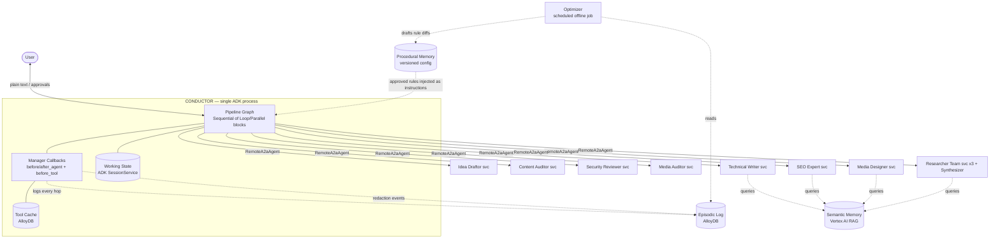
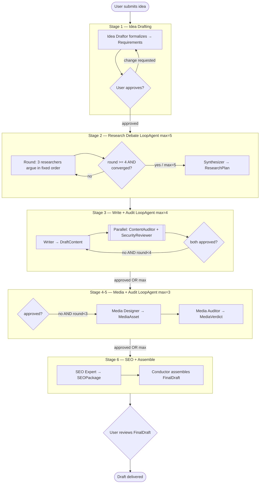
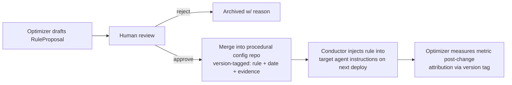
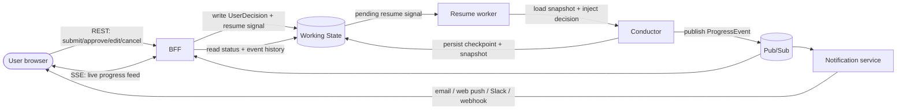
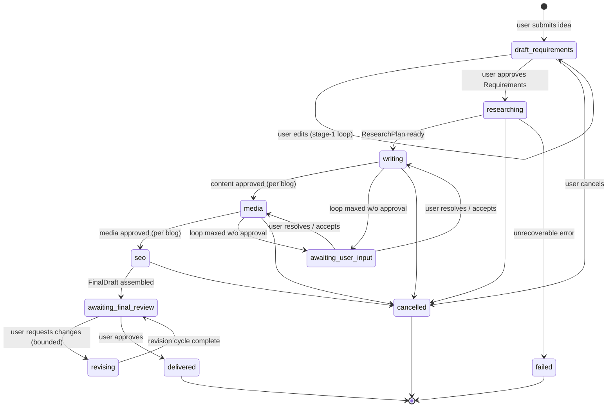
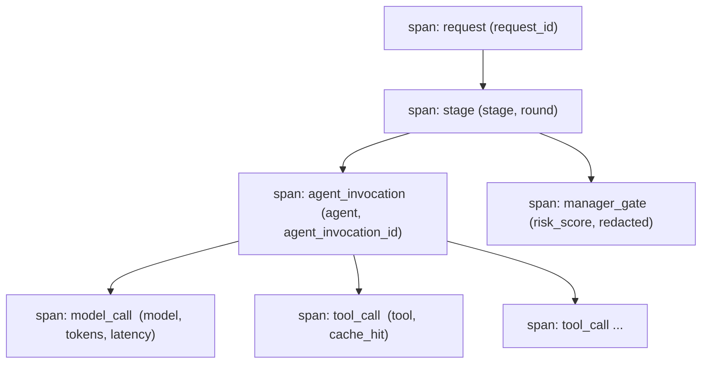

# Product Design Document — Multi-Agent Blogging Harness

**Document status:** Design baseline (v1.2)
**Intended reader:** Human reviewers AND an implementing agent. This document is written to be executed: an agent reading it should be able to reproduce the system with no further design decisions required. Every formerly-open choice is now resolved — see §12; there are no remaining `[OPEN]` markers.
**Non-goal of this document:** production-ready source code. Code blocks are *illustrative excerpts* that fix the shape of an interface or control-flow — they are not complete.
**Delivery model:** the system is built in phases (§15) against a **single GCP-backed runtime** (Vertex AI, AlloyDB, GCS, Pub/Sub). During development the **app process runs locally on a laptop but binds to those GCP backends** via Application Default Credentials and a dev GCP project — there is **no second local-infra deployment** to maintain (§9.5). The only deliberate substitution seam is a **fake `BaseLlm` + mock tools + ADK in-memory services**, selected by a `TEST_MODE` flag, giving a deterministic, offline substrate for evals and CI (§2.4, §13) — a test seam, not a deployment topology.

**Change note (v1.1 → v1.2):** verified against ADK 2.x (GA May 2026). Four resolutions changed: (1) dropped the dual local/GCP ports-and-adapters *deployment* seam in favor of a single GCP runtime with a local dev process (§2.4, §9.5, O-18/O-21); (2) pinned **Gemini 3.0** and build tool-using specialists as two-node worker→structurer units, because `output_schema`+tools is only reliable on Gemini 3.0+ (§3, O-19); (3) re-specified loop-exit as deterministic `BaseAgent` checker sub-agents emitting `escalate`, and made convergence fully deterministic in v1 (§4.4, §4.6, O-20); (4) retained the fake `BaseLlm` **only** as the eval/CI model and dropped Ollama (§9.5, O-14). `a2a_request_meta_provider` and `DatabaseSessionService` were confirmed real, so §9.2/§11.3 are unchanged.

---

## 1. System Overview

### 1.1 Purpose
An autonomous, human-in-the-loop pipeline that turns a plain-text user idea into a fully-formed, media-rich, SEO-optimized blog (single post or a series), produced by a team of specialized agents that research, write, audit, illustrate, and optimize the content under bounded revision loops.

### 1.2 Core design principles (non-negotiable)
1. **Bounded refinement.** Every agent-to-agent revision loop has a hard maximum iteration count. No loop may run unbounded.
2. **Structured everything.** Every inter-agent message and the final output is a schema-validated JSON payload. Loop exit conditions read typed fields (`approved: bool`), never free-text sentiment.
3. **Centralized mediation.** All inter-agent traffic passes through a single logical gateway (the Manager). Leaf agents cannot talk to each other directly.
4. **Human checkpoints.** The user approves at stage 1 (requirements) and stage 6 (final draft). The optimizer's rule changes are also human-approved.
5. **Observe-don't-intervene (mostly).** The Manager observes and logs everything and drafts optimizations offline, but its only *live* mutation authority is stripping detected malicious/injected instructions.

### 1.3 Technology stack
| Concern | Choice |
|---|---|
| Agent runtime | **Google ADK** (Agent Development Kit) — `LlmAgent`, `LoopAgent`, `SequentialAgent`, `ParallelAgent`, `RemoteA2aAgent`, callbacks, `output_schema`. Pinned `google-adk[gcp]>=2.0.0,<3.0.0`. |
| Scaffolding / run / deploy tooling | **`agents-cli`** (Google). Single-agent-per-project scaffolder — each specialist is one `agents-cli` project (§14). Provides per-service Terraform + CI via `agents-cli scaffold enhance`. |
| Inter-service protocol | **A2A (Agent-to-Agent)** protocol. The **MVP runs specialists in-process** as ADK sub-agents; they split into independent A2A services later (§15, M3) **with no change to the Conductor graph** (§2.4). |
| Orchestration | Single ADK process ("Conductor") composing `SequentialAgent` / `ParallelAgent` / `LoopAgent` blocks. |
| Remote specialist binding | ADK `RemoteA2aAgent` (from M3). Splitting a specialist swaps a direct sub-agent reference for a `RemoteA2aAgent` — the graph shape is unchanged (§2.4, §15). |
| Working / session state | ADK **`SessionService`**, keyed by `request_id`: **`VertexAiSessionService`** (or `DatabaseSessionService`→AlloyDB) as the runtime store; **`InMemorySessionService`** under `TEST_MODE`. ADK 2.x sessions are **async** — the AlloyDB path requires an async driver (`asyncpg`). |
| Tool cache | A `tool_cache` table in **AlloyDB**, checked in the Manager's `before_tool_callback` (§5.3). (In-memory/SQLite under `TEST_MODE`.) |
| Semantic memory / RAG | ADK **`MemoryService`**: **`VertexAiRagMemoryService`** at runtime; **`InMemoryMemoryService`** under `TEST_MODE`. Exposed to agents as retrieval tools (§5.4). |
| Artifacts (media, execution-record blobs) | ADK **`ArtifactService`**: **`GcsArtifactService`** (GCS) at runtime; in-memory under `TEST_MODE`. |
| Episodic + redaction log (queryable) | **AlloyDB**, behind an `EpisodicLog` port (SQLite/in-memory under `TEST_MODE`). **BigQuery is deliberately not used** — the pipeline's human-gated volume does not need it and AlloyDB serves both operational and Optimizer queries; the `EpisodicLog` port keeps a future BigQuery sink additive (O-4). |
| Procedural memory (rules) | Version-controlled config repo. |
| LLM access | ADK model layer. **Runtime: Gemini 3.0 via Vertex AI** — 3.0 is pinned because it is the model tier on which ADK reliably supports `output_schema` **with** tools (§3, O-19). **`TEST_MODE`: a fake/stub `BaseLlm`** returning deterministic, schema-valid output — the eval/CI substrate only (§9.5, §13), not a deployment target. |

### 1.4 Topology at a glance
- **One Conductor** (in-process ADK graph) owns sequencing, round-counting, state, and the Manager callbacks.
- **N specialist teams.** In the MVP they are ADK sub-agents in the Conductor process; in production each is a separately-deployed A2A service appearing to the Conductor as a local sub-agent via `RemoteA2aAgent` (§2.4).
- **One Manager**, implemented as ADK callbacks bound to every remote node in the Conductor graph — NOT a separate network proxy.
- **One Optimizer**, a scheduled offline job reading the episodic log.

---

## 2. Architecture

### 2.1 Component diagram



### 2.2 Why this topology
- ADK loop/sequence primitives only operate on sub-agents inside one graph. `RemoteA2aAgent` makes a remote A2A service *look* local, so we keep **all** round-counting and sequencing logic centralized in the Conductor while the specialists remain independently deployable/scalable.
- The Manager is implemented as callbacks *because* the Conductor is the sole dispatcher — every specialist call already funnels through it, so callbacks give us a true chokepoint with zero extra infrastructure and no single-point-of-failure proxy.

### 2.3 Hard architectural constraints
1. **Leaf specialists receive no A2A client credentials.** They can only *respond* to Conductor-issued tasks. This physically prevents peer-to-peer bypass of the Manager. Enforced at deployment: specialist service accounts have no permission to invoke other specialist endpoints; only the Conductor's identity may.
2. **Contracts live in a shared, versioned package** (`blog_contracts`) that every service imports. No service defines its own copy of a payload schema.
3. **The Conductor is stateless between requests except through the Working State store.** A crashed Conductor must be able to resume a request from `request_id` state.

### 2.4 Runtime seams — one GCP backend, a local dev process, and a test-only fake model
The system targets a **single GCP-backed runtime**. It does **not** ship a second, production-grade local deployment. Two lightweight seams give us fast development and deterministic evals without a dual-adapter burden:

**(1) Local dev process → GCP backends (development model "A").** The app process runs on a laptop (`make dev`) and binds directly to GCP services (Vertex AI, AlloyDB, GCS, Pub/Sub) via Application Default Credentials and a dev GCP project. Deploying to Cloud Run is only required for staging/prod (§9), not for day-to-day iteration.

**(2) `TEST_MODE` substitution seam (fake model + mock tools + in-memory services).** For deterministic offline evals (§13) and CI Tier-0, a single `TEST_MODE` flag swaps in a fake `BaseLlm`, mock `Tool` adapters, and ADK's built-in `InMemory*` session/memory/artifact services (plus SQLite/in-memory for the episodic log). This makes the whole pipeline — debate loop, convergence, verdict combination, checkpoints, resume-after-crash — run with **zero external calls**. It is a *test* seam, not a deployment topology.

**Port interfaces are retained (single adapter each).** Where ADK already provides a pluggable service, the port *is* that ADK abstraction. For the custom dependencies we keep a narrow **port interface** — so an offline/alternate adapter stays additive later — but v1 ships **one runtime adapter (GCP)** plus, where noted, the trivial `TEST_MODE` fake. Application and agent code never branch on environment; only the DI wiring differs.

| Port | Satisfied by | Runtime adapter (GCP) | `TEST_MODE` fake |
|---|---|---|---|
| Working/session state | ADK `SessionService` | `VertexAiSessionService` or `DatabaseSessionService`→AlloyDB | `InMemorySessionService` |
| Semantic memory / RAG | ADK `MemoryService` | `VertexAiRagMemoryService` | `InMemoryMemoryService` |
| Artifact/blob store | ADK `ArtifactService` | `GcsArtifactService` (GCS) | in-memory |
| LLM | ADK model (`BaseLlm`) | Gemini 3.0 via Vertex AI | fake/stub `BaseLlm` (deterministic) |
| **`EpisodicLog`** | *custom port* | AlloyDB | SQLite / in-memory |
| **`EventBus`** | *custom port* | Pub/Sub | in-process asyncio pub/sub |
| **`NotificationChannel`** | *custom port* | email / web-push / Slack / webhook | console |
| **`AgentIdentity`** | *custom port* | Cloud Run OIDC + IAM (deployed A2A services); signed-JWT dev-key adapter if the split services are run on a laptop (§9.2) | no-op (in-process MVP — no network boundary) |
| **`Tool`** | *custom port* | real API | deterministic mock |

- **Migration seam (in-process → services).** ADK is designed so the *same* agent object runs as a local sub-agent **or** is exposed as an A2A service (`to_a2a()`), and `RemoteA2aAgent` is a drop-in that looks local to the graph. Because every hop already travels as a §7 envelope, splitting a specialist into a service changes **only the leaf node** (direct reference → `RemoteA2aAgent`) — the Conductor's loops, exit checkers, and checkpoints are untouched (§15, M3).
- **Deployment pipeline** is a single `deploy/gcp/` (Terraform + Cloud Run, largely generated per-service by `agents-cli scaffold enhance`, §14). There is no `deploy/local/`; local iteration is the dev process of seam (1).

---

## 3. Agent Roster

Each specialist below is deployed as **one** A2A service (one Agent Card) and emits its §7 contract via an ADK `output_schema` on its **terminal output node**. Tool-free specialists (Synthesizer) are a single `output_schema` `LlmAgent`; tool-using specialists are built internally as the **two-node worker→structurer unit** defined in the note below, but remain **one logical agent** everywhere else in this document (roster count, envelope `sender_agent`, round-counting, agent card).

| # | Agent | Type | Stage | Consumes | Produces | Tools |
|---|---|---|---|---|---|---|
| 1 | **Idea Draftor** | LlmAgent | 1 | user text + past-post dedup | `Requirements` | `past_posts_search` |
| 2a | **Researcher: User-Intent** | LlmAgent | 2 | `Requirements`, debate transcript | `DebateTurn` | `web_search`, RAG |
| 2b | **Researcher: Industry-Gap** | LlmAgent | 2 | same | `DebateTurn` | `web_search`, RAG |
| 2c | **Researcher: Audience-Demand** | LlmAgent | 2 | same | `DebateTurn` | `web_search`, RAG |
| 2d | **Synthesizer** | LlmAgent | 2 | full debate transcript | `ResearchPlan` | — |
| 3 | **Technical Writer** | LlmAgent | 3 | `ResearchPlan`, unresolved `AuditVerdict` issues | `DraftContent` | `brand_style_search`, RAG |
| 4 | **Content Auditor** | LlmAgent | 3 | `DraftContent`, `Requirements` | `AuditVerdict` | `fact_check`, `plagiarism` |
| 5 | **Security Reviewer** | LlmAgent | 3 | `DraftContent` | `AuditVerdict` | `secret_scan` |
| 6 | **Media Designer** | LlmAgent | 4 | finalized `DraftContent`, unresolved media issues | `MediaAsset[]` | `image_gen`, `diagram_gen`, `logo_overlay` |
| 7 | **Media Auditor** | LlmAgent | 5 | `MediaAsset[]`, blog body | `MediaVerdict` | `image_analysis` |
| 8 | **SEO Expert** | LlmAgent | 6 | finalized blog + media | `SEOPackage` | `keyword_research`, RAG |
| — | **Conductor** | Custom orchestrator | all | — | `FinalDraft` | — |
| — | **Manager** | Callback module | all | every hop | log records, redactions | `guardrail_classifier` |
| — | **Optimizer** | Scheduled LlmAgent | offline | episodic log | `RuleProposal[]` | `sql_query` (AlloyDB) |

> **Tool-using agents — `output_schema` + tools (mandatory build pattern).** Combining an ADK `output_schema` with tools in a *single* `LlmAgent` is only reliable on **Gemini 3.0+**; on other models ADK effectively disables tool use when `output_schema` is set. Every tool-using specialist above (Idea Draftor, the 3 researchers, Technical Writer, both Auditors, Media Designer, Media Auditor, SEO Expert) is therefore built in `blog_agent_kit` as a **two-node unit**: a **worker** (`LlmAgent` *with tools, no `output_schema`*) that does the retrieval/analysis, feeding a **structurer** (`LlmAgent` *with `output_schema`, no tools*) that emits the §7 contract. Tool-free agents (Synthesizer) are a single `output_schema` node. This keeps the roster declarative and model-portable (fake model, Gemini). On the pinned Gemini 3.0 runtime the two nodes MAY be collapsed into one as an optimization, but the two-node form is the canonical, portable build (O-19).
>
> **Packaging (so the rest of this doc still reads "one agent").** The worker+structurer pair is an **internal `SequentialAgent`** (`blog_agent_kit` builds it) presented as **one logical specialist**: one A2A Agent Card, one A2A service, one row in §9.1's "11 specialists," and **one §7 envelope per hop** whose `payload` is the **structurer's** validated output. `output_schema` lives on the **structurer** only; the worker carries the tools and no `output_schema`. Each node still emits its own `AgentExecutionRecord` (§11.4) — the **worker's** holds the `tool_calls`, the **structurer's** holds the `output_payload` — and both records carry the **logical** `agent_name`. The Conductor graph, the Manager, round-counting, and `envelope.sender_agent` all use the logical specialist name; the internal split is invisible to them.

---

## 4. Pipeline Specification

### 4.1 Stage flow with round bounds



### 4.2 Stage details

Each stage is specified with: **trigger, actor(s), loop construct, exit condition, escalation, output.**

#### Stage 1 — Idea Drafting
- **Trigger:** user submits plain-text idea.
- **Actor:** Idea Draftor.
- **Loop construct:** NOT an agent-to-agent `LoopAgent`. This is a **user-paced conversational loop** driven by the Conductor (surface, suspend/resume, and approval mechanics: §10.3). Each turn, the Idea Draftor emits a `Requirements` object with `approved_by_user=false` plus an `open_questions` list; the Conductor surfaces it to the user; the user replies with edits or approval.
- **Exit condition:** user sends explicit approval → Conductor sets `approved_by_user=true`, stamps `approval_timestamp`.
- **Dedup behavior:** before the first draft, Idea Draftor calls `past_posts_search` on the semantic memory; if a near-duplicate published post exists, it surfaces this in `open_questions` ("We already published X — narrow the angle?"). See §6.4.
- **Output:** approved `Requirements`.

#### Stage 2 — Research Debate
- **Trigger:** approved `Requirements`.
- **Actors:** 3 researchers (fixed roles) + Synthesizer.
- **Loop construct:** `LoopAgent(max_iterations=5)`. Within one iteration, the 3 researchers run in a **fixed sequential order** (User-Intent → Industry-Gap → Audience-Demand) so each can rebut the previous within the same round. (Parallel is rejected here: debate requires each agent to see the others' latest arguments.)
- **Per-round mechanics:** see §4.3.
- **Exit condition:** `round >= 4` AND convergence detected (see §4.4). Hard stop at `max_iterations=5` regardless.
- **Escalation:** none to the user — unresolved points are carried into `ResearchPlan.open_disagreements`, not hidden.
- **Output:** `ResearchPlan` (contains `blog_plan[]` — one entry for single post, N entries for a series).

#### Stage 3 — Write + Audit
- **Trigger:** `ResearchPlan`. For a series, the Conductor **fans out**: stages 3–6 run once per `blog_id` (see §4.5).
- **Actors:** Technical Writer; Content Auditor + Security Reviewer.
- **Loop construct:** `LoopAgent(max_iterations=4)` wrapping `[Writer, ParallelAgent([ContentAuditor, SecurityReviewer])]`. The two auditors run in **parallel** (independent, no cross-dependency).
- **Exit condition:** BOTH auditors return `approved=true`. Verdict-combination logic in §4.6.
- **Escalation:** if round 4 completes without dual approval, the Conductor marks **this blog's branch** `needs_user_input` in Working State (there is no `FinalDraft` object yet — it is assembled only at the §4.2 Stage-6 join, where this surfaces as `FinalDraft.status` and in `process_summary.escalations`, §7.9). It does NOT silently ship. This raises an `escalation` checkpoint (§10.3).
- **Output:** finalized `DraftContent` for this `blog_id`.

#### Stage 4–5 — Media Generation + Audit
- **Trigger:** finalized `DraftContent`.
- **Actors:** Media Designer; Media Auditor.
- **Loop construct:** `LoopAgent(max_iterations=3)` wrapping `[MediaDesigner, MediaAuditor]` (sequential — the auditor needs the generated asset).
- **Media scope:** header image if warranted, diagrams for technical concepts, inline illustrations. Company logo overlaid via `logo_overlay` tool (`has_logo` must be `true` where brand policy requires).
- **Exit condition:** `MediaVerdict.approved=true`. Categories: brand/logo compliance, accessibility (`alt_text` present, contrast), resolution/placement correctness.
- **Escalation:** same pattern as stage 3 — max-out → `needs_user_input`.
- **Output:** approved `MediaAsset[]` with placements.

#### Stage 6 — SEO (per blog) + Assembly
- **Trigger (SEO):** finalized content + approved media **for a single `blog_id`**. SEO runs **per blog**, inside that blog's fan-out branch (§4.5) — one `SEOPackage` per blog. Media (stage 4–5) is likewise **per blog**.
- **Trigger (assembly):** **all** blog branches in the request have completed SEO. The Conductor joins the branches and assembles one terminal `FinalDraft`.
- **Actors:** SEO Expert (once per blog), then Conductor (once, at the join).
- **Loop construct:** none — a single `SequentialAgent` pass per blog (SEO has no counterpart to loop against).
- **Output:** a per-blog `SEOPackage`; after the join, Conductor assembles the terminal `FinalDraft` (§7.9) and raises one `final_review` checkpoint for the user (§10.3, §10.7).

### 4.3 Debate per-round mechanics
Each round appends to a shared `debate_transcript` held in Conductor Working State (not in each agent's context — see compaction §5.2).

```
For round r in 1..5:
    for role in [user_intent, industry_gap, audience_demand]:
        context = compact_history(debate_transcript)      # see §5.2
                + full_text(previous_round)                # sliding window = 1 round
                + requirements
        turn = researcher[role].run(context)              # emits DebateTurn
        debate_transcript.append(turn)
    if r >= 4 and converged(debate_transcript): break
synthesizer_context = all_round_summaries + full_text(last_round)
research_plan = synthesizer.run(synthesizer_context)
```

**ADK realization (this pseudocode is the *logical* behavior, not a hand-written loop).** It is realized with ADK primitives: the Stage-2 `LoopAgent(max_iterations=5)` wraps a `SequentialAgent[researcher_user_intent, researcher_industry_gap, researcher_audience_demand, round_summary_step, debate_exit_checker]`. Each researcher is itself the two-node worker→structurer unit (§3). The per-researcher `context` (compacted history + previous-round full text + requirements, §5.2) is **not** passed as a Python argument — it is assembled from `debate_transcript` in session state by an **instruction provider / `before_agent_callback`** on each researcher node. `round_summary_step` and `debate_exit_checker` are deterministic `BaseAgent`s (no model call); the `break` above ≙ the checker setting `escalate` per §4.4. The Synthesizer runs **after** the loop, as the next node in the Stage-2 sequence.

### 4.4 Convergence detection (fully deterministic in v1)
Convergence is checked **without any LLM**: a round is "converged" when every researcher's `DebateTurn.position_shift` is `null` (nobody moved) for two consecutive rounds. Any non-null `position_shift` counts as "not converged." (v1.1 reserved a cheap LLM fallback for "ambiguous" cases; v1.2 **drops it** — the trigger was undefined and the rule above decides every case, keeping loop-exit deterministic and testable.)

**ADK implementation.** `LoopAgent` has no exit-predicate parameter; it exits only on `max_iterations` or when a sub-agent emits `escalate=True` in its `EventActions`. Convergence is therefore implemented as a deterministic **`BaseAgent` checker** ("debate exit checker") appended as the **last sub-agent inside the Stage-2 `LoopAgent`**. It reads the `debate_transcript` from session state and, when `round >= 4` AND converged, sets `ctx.actions.escalate = True` to stop the loop. No model call is involved. (Same mechanism as §4.6; escalate-propagation caveat there applies.)

### 4.5 Series fan-out
When `ResearchPlan.blog_plan` has >1 entry, the Conductor runs stages **3, 4–5, and 6 per `blog_id`** — writing, media, **and SEO all execute inside each blog's own branch** (each branch carries its own loop state). Branches run as **parallel branches with a concurrency cap of 3** (O-1) to reduce wall-clock time while avoiding tool-rate-limit storms. The Conductor **joins all branches** once every branch has finished its per-blog SEO, then assembles a single `FinalDraft` (§4.2 Stage 6 assembly trigger). Cross-blog consistency (shared terminology, no overlap) is enforced by giving every writer branch read access to the sibling blogs' finalized outlines from `ResearchPlan`.

### 4.6 Loop exit / verdict combination
The stage-3 loop must combine **two** parallel verdicts into one continue/stop decision. Rules, in order:

1. **Continue (revise)** if either verdict has `approved=false`.
2. When continuing, the Writer's next-round context receives the **union** of unresolved issues from both auditors.
3. A `blocker`-severity issue from *either* auditor forces continuation even if the other auditor approved.
4. **Security overrides content.** If Security Reviewer reports any `blocker`, the loop cannot exit as "approved" even at max_iterations — instead it forces `needs_user_input` (a security blocker must never be auto-shipped, unlike a content `minor`).
5. **Stop (approved)** only when both `approved=true` AND no open `blocker`/`major`.

**ADK implementation.** This is **not** a predicate the Conductor calls between nodes — `LoopAgent` offers no such hook. It is a deterministic **`BaseAgent` checker** ("stage-3 exit checker") appended as the **last sub-agent inside the Stage-3 `LoopAgent`**. Each iteration it reads both `AuditVerdict`s from session state, applies the rules above, writes the resulting `status` (`approved` | `needs_user_input`) to state, and sets `ctx.actions.escalate = True` when the loop must stop. No model call. The illustrative function below is the body of that checker.

> **Escalate-propagation caveat (verify in M0).** In ADK, a sub-agent's `escalate=True` has historically propagated past the `LoopAgent` up to the root, which can also halt the **parent `SequentialAgent`** — i.e. exiting one stage-loop could wrongly stop the whole pipeline. Since the Conductor is a *Sequential of Loop blocks* (§2.1, §4.1), each loop must exit **and let the sequence continue to the next stage**. **M0 includes a spike** to confirm, on the pinned ADK 2.x, that a `LoopAgent` nested in a `SequentialAgent` exits without halting the parent (using whatever scoping ADK 2.x provides, e.g. a `halt_on_escalate`-style control or a scoped-escalate pattern); if unavailable, the Conductor wraps each stage-loop so the escalate is caught at the loop boundary and the sequence resumes. This is the single highest-risk orchestration unknown (§15, M0).

```python
# Illustrative — body of the deterministic stage-3 exit checker BaseAgent (not full code)
def stage3_should_exit(content: AuditVerdict, security: AuditVerdict, round: int) -> ExitDecision:
    open_blockers = [i for v in (content, security) for i in v.issues if i.severity == "blocker"]
    if content.approved and security.approved and not open_blockers:
        return ExitDecision(exit=True, status="approved")
    if round >= MAX_ROUNDS_STAGE3:  # 4
        # security blocker can never auto-ship
        if any(i.severity == "blocker" for i in security.issues):
            return ExitDecision(exit=True, status="needs_user_input", reason="security_blocker")
        return ExitDecision(exit=True, status="needs_user_input", reason="max_rounds")
    return ExitDecision(exit=False)  # loop again with union of unresolved issues
```

---

## 5. Memory & Compaction

Four distinct concerns, deliberately separated. Conflating them is a design error.

### 5.1 Taxonomy

| Kind | What | Store | Lifetime |
|---|---|---|---|
| **Working memory** | per-request state: current drafts, transcript, loop counters, revision history | ADK **`SessionService`**, keyed by `request_id` (VertexAi/AlloyDB runtime; InMemory under `TEST_MODE`) | request + short retention |
| **Tool memory** | cached results of expensive/idempotent tool calls | `tool_cache` table, keyed by `(tool, canonical_args)` (AlloyDB; SQLite/in-memory under `TEST_MODE`) | TTL by volatility |
| **Episodic memory** | structured records of past runs (payloads, round counts, issue categories, escalations, redactions) | **AlloyDB** via the `EpisodicLog` port (SQLite/in-memory under `TEST_MODE`) | long, queryable |
| **Semantic memory** | brand style guide, tone rules, logo assets, past-post corpus, SEO guidelines | ADK **`MemoryService`**: `VertexAiRagMemoryService` (InMemory under `TEST_MODE`) | curated, persistent |
| **Procedural memory** | Manager-drafted, human-approved rules promoted into agent instructions | Version-controlled config | versioned, persistent |

### 5.2 Context compaction (the "compaction technique")
Compaction keeps per-LLM-call context bounded as rounds accumulate. **Principle: compact structurally (filter/drop) wherever the schema allows; reserve LLM summarization only for free-text fields that cannot be safely truncated.**

**Debate loop (quadratic-growth risk).**
- After each round, a deterministic step produces a `RoundSummary = {round, per_agent_stance_1liner, unresolved_tensions[]}`.
- Subsequent rounds receive: `compacted_history` (all prior `RoundSummary`) + **full text of only the immediately preceding round** (sliding window = 1 round).
- Only genuinely free-text fields (`DebateTurn.argument`, `evidence[].claim`) are LLM-summarized into the one-liner; structured fields are dropped, not summarized.
- Synthesizer receives all `RoundSummary` + full text of the last round only.

**Revision loop (writer ↔ auditors).**
- The writer's next-round context = **current draft + only unresolved issues**. Because `AuditVerdict.issues[].id` and `DraftContent.addressed_feedback[]` exist, dropping resolved issues is a pure filter — no summarization needed.
- Resolved issues are moved to `revision_history` (for the final audit trail) and out of live context.

**Trigger discipline.** Compaction fires at **structural boundaries we control** (end of round, end of version) — NOT reactively on a token-budget threshold. Reactive triggers are fragile across model swaps and hard to test.

```python
# Illustrative debate context assembly
def build_debate_context(transcript: list[DebateTurn], round: int) -> str:
    summaries = [round_summary(r) for r in transcript.rounds[:round-1]]   # structural, cheap
    last_full = transcript.rounds[round-1].as_text()                      # sliding window = 1
    return render(summaries=summaries, last_round=last_full, requirements=req)
```

### 5.3 Tool memory (result caching)
- Key: `sha256(tool_name + canonicalize(args))`. Canonicalization sorts keys, normalizes whitespace/casing so semantically identical calls collide.
- TTL by volatility: `keyword_research` ~24h; `web_search` per-request only (never cross-request — freshness matters); `plagiarism`/`fact_check` ~7d; `past_posts_search` invalidated on new publish.
- **Check point:** the Manager's `before_tool_callback` (it already intercepts every tool call). On hit → short-circuit return cached result; on miss → allow, then store in `after_tool_callback`.
- Caching is **deterministic and LLM-free** — identical inputs, identical cached outputs. The cache never decides *whether* a tool is appropriate, only reuses prior results.

### 5.4 Semantic memory (RAG)
- Backed by Vertex AI RAG Engine, wired via ADK `VertexAiRagMemoryService`.
- Exposed to agents as retrieval **tools** (`brand_style_search`, `past_posts_search`), not auto-injected — agents decide when to query.
- Corpora: `brand_style`, `published_posts`, `seo_guidelines`, `logo_assets` (asset refs + usage rules).
- **Single-tenant (O-22):** these corpora are **global to the one organization** — there is no per-tenant partition key. Every request reads the same brand/style/SEO corpora, and dedup (§6.4) spans all of the org's published posts. Multi-tenant scoping is explicitly out of scope for v1.
- Ingestion: on each user-accepted `FinalDraft` publish, the post is embedded into `published_posts` (closes the dedup loop for stage 1).

### 5.5 Episodic memory (learning substrate)
- Stores **structured records, not raw transcripts** — the payload schemas from §7 plus loop metadata.
- Schema keyed by `request_id` and `schema_version` so it **joins with the redaction log** (§6.5). This join answers "did rule change X reduce security-flag frequency?" — key both from day one.
- Queried only by the Optimizer (§8), never in a live request.

---

## 6. Manager / Gateway

### 6.1 Role
The Manager is the **centralized mediator**: every inter-agent transaction passes through it. It has three jobs: (a) **guardrail** — detect and strip malicious/injected instructions between agents; (b) **log** — persist every hop to episodic memory; (c) **cache** — the tool-cache check point. It does **NOT** intervene in content quality or loop decisions — that is the Conductor's job. Its optimizer half (§8) runs offline.

### 6.2 Implementation — callbacks, not a proxy
The Manager is a set of ADK callbacks bound to **every** `RemoteA2aAgent` node and tool in the Conductor graph. Because the Conductor is the sole dispatcher, these callbacks are a true chokepoint with no extra network hop or SPOF.

```python
# Illustrative — Manager wired onto every remote node
def make_managed(remote: RemoteA2aAgent) -> RemoteA2aAgent:
    remote.before_agent_callback = manager.inspect_inbound   # guardrail + risk score
    remote.after_agent_callback  = manager.inspect_outbound  # guardrail + log hop
    remote.before_tool_callback  = manager.tool_gate         # cache check + guardrail
    remote.after_tool_callback   = manager.tool_store        # cache store
    return remote
```

### 6.3 Guardrail pipeline (per message)
Two-tier, cheap-first:
1. **Tier 1 — structural/pattern (deterministic).** Regex/heuristics for injection signatures: text addressed to "the next agent"/"the system", role-override phrases, embedded tool-call directives, base64 blobs in prose fields. High-confidence structural hits are **hard-stripped**.
2. **Tier 2 — LLM classifier (escalation only).** Invoked only when Tier 1 raises a low-confidence signal. Produces `risk_score`.

**False-positive safety.** A blog *about* prompt injection legitimately contains phrases like "ignore previous instructions." Therefore:
- Tier 1 hard-blocks only **structural** injection (instructions *addressed to an agent/system*, not quoted example text in the reader-facing body).
- Everything below high confidence is **flag + log, do not strip** in v1. Redaction is reserved for high-confidence structural hits.
- Every redaction is recorded in `manager_meta.redaction_notes` on the envelope AND in the redaction log, so nothing is silently altered.

### 6.4 What the Manager writes to the envelope
The Manager populates `envelope.manager_meta` (`redacted`, `redaction_notes[]`, `risk_score`) — the sending agent never populates this. Downstream, this surfaces in `FinalDraft.process_summary.manager_flags`.

### 6.5 Logging
Every hop → episodic log record: `{request_id, stage, round, sender, receiver, payload_ref, risk_score, redacted, timestamp}`. Redaction events additionally → a **redaction log** keyed by the same `request_id`/`schema_version` so it joins with episodic data. This hop-level log is the **structured/wire** layer; the **full-fidelity per-agent** layer (prompts, reasoning, raw model I/O) is defined in §11.4 and correlates to these records by the shared ID set (§11.2).

### 6.6 Contract-version enforcement
The Manager rejects/flags any envelope whose `schema_version` it does not recognize rather than passing it through — this makes schema drift between independently-deployed services fail loudly, not silently.

---

## 7. Data Contracts

**Governance:** all schemas live in a shared versioned package `blog_contracts` imported by every service. Each specialist's **terminal output node** (the structurer, or the single node for a tool-free agent — see §3) sets its ADK `output_schema` to the matching Pydantic model so malformed output is rejected *at the producing agent* before it reaches the Manager or the next hop. (Worker nodes carry tools and no `output_schema`; their output is consumed only by their own structurer, never sent as a hop.) The Manager validates *content/safety*; ADK `output_schema` validates *shape*. `schema_version` is bumped deliberately on any breaking change.

### 7.1 Envelope (wraps every hop)
```jsonc
{
  "schema_version": "1.0",
  "request_id": "uuid",
  "stage": "idea_drafting|research_debate|writing|content_audit|security_audit|media_generation|media_audit|seo",
  "round": 0,
  "sender_agent": "string",           // agent card name
  "parent_message_id": "uuid|null",   // threads feedback to the version it targets
  "timestamp": "datetime",
  "manager_meta": {                   // populated by Manager, NOT the sender
    "redacted": false,
    "redaction_notes": [],
    "risk_score": 0.0
  },
  "payload": { /* stage-specific, §7.2–7.9 */ }
}
```
Transport mapping: envelope → A2A `Message` metadata; `payload` → A2A `DataPart` (typed JSON part).

> **Three distinct enums — do not conflate.** (1) `envelope.stage` above is the **fine-grained pipeline position** (8 values). (2) The **request lifecycle status** (§10.2: `draft_requirements | researching | writing | media | seo | awaiting_final_review | awaiting_user_input | revising | delivered | cancelled | failed`) is the **coarse, user-facing** state of the whole request. (3) The **checkpoint type** (§10.3: 4 values) names a pending human decision. They are different dimensions correlated only by `request_id`; several `envelope.stage` values map to one lifecycle status (e.g. `writing`+`content_audit`+`security_audit` all occur while the request status is `writing`). Nothing in the system converts one enum into another by string equality.

### 7.2 Requirements  (Idea Draftor → user loop → Conductor)
```jsonc
{
  "topic": "string",
  "goal": "string",
  "audience": "string",
  "format": "single|series",
  "series_length": 0,
  "tone": "string",
  "constraints": ["string"],
  "success_criteria": ["string"],
  "open_questions": ["string"],        // surfaced to user each turn until approval
  "approved_by_user": false,
  "approval_timestamp": "datetime|null"
}
```

### 7.3 DebateTurn  (each researcher, each round)
```jsonc
{
  "researcher_role": "user_intent|industry_gap|audience_demand",
  "round": 1,
  "argument": "string",
  "evidence": [{ "claim": "string", "source": "string", "confidence": 0.0 }],
  "rebuttals_to": [{ "target_role": "string", "point": "string" }],
  "position_shift": "string|null"      // null = did not move (feeds convergence, §4.4)
}
```

### 7.4 ResearchPlan  (Synthesizer)
```jsonc
{
  "content_angle": "string",
  "key_themes": ["string"],
  "target_keywords": ["string"],
  "differentiation_points": ["string"],
  "audience_pain_points": ["string"],
  "outline": [{ "section_title": "string", "purpose": "string" }],
  "open_disagreements": ["string"],    // unresolved debate points — surfaced, not hidden
  "blog_plan": [                        // >1 entry ⇒ series
    { "blog_id": "string", "title": "string", "angle": "string",
      "outline": [{ "section_title": "string", "purpose": "string" }] }
  ]
}
```
**Cardinality constraint (drives fan-out, §4.5).** `blog_id` values are unique within a `blog_plan`. For `Requirements.format="single"`, `blog_plan` has **exactly 1** entry. For `="series"`, `len(blog_plan) == Requirements.series_length` — the Synthesizer is instructed to honor `series_length`. The Conductor **validates** this immediately after Stage 2 and, on mismatch, raises an `escalation` checkpoint (§10.3) rather than fanning out an unexpected number of branches.

### 7.5 DraftContent  (Writer, each revision)
```jsonc
{
  "blog_id": "string",
  "version": 1,
  "title": "string",
  "body_markdown": "string",
  "word_count": 0,
  "sections": [{ "heading": "string", "content": "string" }],
  "citations": [{ "claim": "string", "source_url": "string" }],
  "addressed_feedback": ["issue_id"]   // which prior audit issues this version fixes
}
```

### 7.6 AuditVerdict  (Content Auditor / Security Reviewer) — the loop exit condition
```jsonc
{
  "reviewer": "content_auditor|security_reviewer",
  "target_version": 1,
  "approved": false,
  "issues": [
    { "id": "string",
      "severity": "blocker|major|minor",
      "category": "string",
      "location": "string",           // section/line reference
      "description": "string",
      "suggested_fix": "string" }
  ],
  "summary": "string"
}
```

### 7.7 MediaAsset  (Media Designer)
```jsonc
{
  "asset_id": "string",
  "version": 1,
  "type": "header_image|diagram|inline_illustration",
  "placement": "string",              // section reference
  "url_or_ref": "string",
  "alt_text": "string",
  "has_logo": false,
  "generation_prompt": "string"
}
```

### 7.8 MediaVerdict  (Media Auditor)
Same shape as `AuditVerdict`; `reviewer="media_auditor"`; categories scoped to `brand_logo|accessibility|resolution|placement`.

### 7.9 SEOPackage & FinalDraft
```jsonc
// SEOPackage (SEO Expert)
{
  "meta_title": "string",
  "meta_description": "string",
  "slug": "string",
  "target_keywords": ["string"],
  "internal_link_suggestions": ["string"],
  "schema_markup": { },
  "og_tags": { }
}
```
```jsonc
// FinalDraft (Conductor → user) — terminal structured response
{
  "request_id": "uuid",
  "status": "ready_for_review|needs_user_input",
  "requirements": { /* Requirements */ },
  "research_plan": { /* ResearchPlan */ },
  "blogs": [
    { "blog_id": "string", "title": "string", "body_markdown": "string",
      "word_count": 0,
      "revision_history": [{ "version": 1, "audit_summary": "string" }],
      "media": [ /* MediaAsset */ ],
      "seo": { /* SEOPackage */ } }
  ],
  "process_summary": {
    "rounds_used": { "research": 0, "editorial": 0, "media": 0 },
    "escalations": ["string"],        // loops that hit max without full approval
    "manager_flags": ["string"]       // redactions/security events this run
  },
  "user_action_required": ["string"]  // empty ⇒ fully clean
}
```

---

## 8. Optimizer (offline learning loop)

### 8.1 Trigger & scope
Scheduled job (nightly, or after N completed requests). Reads **episodic + redaction logs only**. Never touches a live request. Emits `RuleProposal[]` as a reviewable diff.

### 8.2 What it analyzes
- Round-count distributions per stage (which loops routinely near their max?).
- Recurring `AuditVerdict.issues[].category` (systematic writer weaknesses → candidate writer-instruction rule).
- Recurring redaction patterns.
- Escalation frequency and cause.

### 8.3 RuleProposal contract
```jsonc
{
  "proposal_id": "string",
  "target_agent": "string",
  "rule_type": "instruction|tool|constraint",
  "evidence": { "metric": "string", "before_value": 0.0, "sample_size": 0 },
  "proposed_change": "string",        // human-readable diff / new instruction text
  "expected_effect": "string",
  "status": "proposed"                // → approved|rejected by human
}
```

### 8.4 Promotion workflow (proposal → live)

Rules are version-tagged with the pattern that motivated them, so later round-count improvements are attributable to specific changes. Procedural memory is config, not a database — it goes through human review/diff.

---

## 9. Deployment & Operations

### 9.1 Service inventory
- 1 Conductor service (holds graph + Manager callbacks + Optimizer schedule trigger).
- 11 specialist agents (§3). **In the MVP these run in-process** inside the Conductor; **from M3 each is a separate A2A service** publishing an **A2A Agent Card** describing its skills and I/O schema. Each is a standalone `agents-cli` project (§14).
- Interaction layer (§10): 1 web SPA, 1 BFF/API gateway, 1 notification service, plus a resume worker (may run in-process with the Conductor).
- Shared stores: ADK `SessionService` (working+session state), AlloyDB (episodic + tool cache), ADK `MemoryService`→Vertex AI RAG (semantic), ADK `ArtifactService`→GCS (artifacts), config repo (procedural), `EventBus`→Pub/Sub (progress-event bus).
- Whole system is one **`uv` workspace monorepo** (§14); shared logic lives in versioned packages every service imports.

### 9.2 Identity, authentication & least privilege
- **Every A2A call is authenticated.** The Conductor attaches a short-lived signed token to each outbound specialist call; the specialist verifies it before responding. The token is injected uniformly through ADK's `RemoteA2aAgent(a2a_request_meta_provider=…)` — the **same** hook that carries the trace context (§11.3) — so auth and tracing ride together on every hop.
  - **Split services on a laptop (dev):** a locally-signed **JWT** (dev key). The callee verifies signature, audience (itself), and that the caller subject is the Conductor. This reproduces the §2.3.1 "only the Conductor may call specialists" rule with **no cloud dependency**.
  - **Deployed services (GCP):** Cloud Run service-to-service **OIDC ID tokens** + IAM — only the Conductor's service account holds `run.invoker` on specialist services, so peer-to-peer invocation is impossible at the platform layer.
  - This applies **only once specialists are split into services (M3, §15)**. In the in-process MVP (M1–M2) there is no network boundary; the `AgentIdentity` port is present but its adapter is a no-op. (Note: this JWT/OIDC axis is orthogonal to `TEST_MODE`, which concerns the model/tools/stores, not auth.)
- Only the Conductor's service identity may invoke specialist endpoints (enforces §2.3.1).
- Specialists get read access to their required RAG corpora and tools only.
- Optimizer gets read-only on logs, write on proposal store.

### 9.3 Resilience
- **Idempotency:** every stage keyed by `(request_id, stage, blog_id, round)`; re-running a completed step returns the stored result rather than re-executing.
- **Resume:** Conductor reconstructs in-flight requests from Working State on restart.
- **Retries:** transient A2A/tool failures retried with backoff (**3 attempts, exponential backoff** — O-2); exhausted retry → escalate that request to `needs_user_input`, never silent drop.
- **Timeouts:** per-agent call timeout; a hung specialist counts as a failed round, not an infinite wait.

### 9.4 Observability
Full treatment in **§11** (Observability, Logging & Tracing). In brief: three pillars (structured logs, distributed traces, metrics) plus a fourth — full-fidelity per-agent execution records — all correlated by a shared ID set and captured through one uniform instrumentation bundle every service installs.

### 9.5 Development model — local process against GCP backends (+ offline `TEST_MODE`)
The runtime is **GCP-only** (there is no second production-grade local deployment). Two things make day-to-day development fast and testing deterministic:

- **Local dev process (model "A").** The app runs on a laptop via `make dev` and **binds directly to GCP backends** (Vertex AI, AlloyDB, GCS, Pub/Sub) using Application Default Credentials (`gcloud auth application-default login`) and a dev GCP project. No Cloud Run deploy is needed to iterate; no local emulation layer is maintained. This does require a GCP project + billing + the relevant APIs enabled before the app can run against real backends.
- **Offline `TEST_MODE` (deterministic substrate for evals/CI).** A single `TEST_MODE` flag swaps in:
  - **Fake LLM** — a custom ADK `BaseLlm` returning **deterministic, schema-valid** payloads per agent (scripted by scenario fixtures keyed by `agent + stage + round + state`, so the debate converges, an audit raises then clears a `blocker`, and an escalation can be forced), so the entire pipeline — debate loop, convergence, writer↔auditor revision, verdict combination, checkpoints, observability, resume-after-crash — exercises end-to-end **with zero model calls**.
  - **Mock tools** (§5.3) returning canned results, and **ADK `InMemory*`** session/memory/artifact services plus SQLite/in-memory episodic log.
  - Result: a fully reproducible run that needs **no GCP credentials and no network** — the substrate for the deterministic eval tiers (§13) and CI Tier-0. This retires v1.1's "no GCP, no key" *deployment* goal but preserves its real benefit (free, deterministic tests).
- **Ollama dropped.** v1.1 offered Ollama for local real inference; it does not reliably support `output_schema`+tools (§3), so it is removed. Real inference is Gemini 3.0 via Vertex only; `TEST_MODE` covers the offline path.
- **In-process specialists (M1).** The MVP has no network boundary (§2.4), so no A2A serving, agent cards, or inter-agent auth are required until the M3 split.

Real integrations beyond the dev backends (Cloud Run topology, IAM least-privilege, real §M7 tools) are introduced across later milestones (§15) without touching agent or orchestration code.

---

## 10. User Interaction & Execution Model

This section defines how a human user drives the pipeline. It is the counterpart to §4 (which defines *what* the agents do); this defines *how the user experiences and controls* it. Because the pipeline is long-running and human-gated, the execution model is **asynchronous with durable suspend/resume** — the Conductor is not a straight-through graph but a resumable process that pauses at human checkpoints and wakes on external events.

### 10.1 Surface
Primary surface: a **dedicated web application**. Three cooperating pieces (all new services, extend the §9.1 inventory):

| Piece | Responsibility |
|---|---|
| **Web SPA** (frontend) | Idea submission, live progress feed, checkpoint review/approval UI, draft+media rendering, notification-channel settings, admin view for rule proposals. **Built with Next.js (React) and SCSS Modules** for a premium, highly dynamic aesthetic. |
| **BFF / API gateway** | Authenticates users; exposes REST for actions (submit, approve, edit, cancel) and a streaming endpoint for the live feed; validates every `UserDecision` against the pending checkpoint before signaling resume. The user's browser never talks to the Conductor or specialists directly. |
| **Notification service** | Dispatches to the user's configured channels when a checkpoint needs input or a run completes. |

The optimizer's `RuleProposal` review (§8.4) is a **separate admin surface** in the same SPA, routed to admins — not to the requesting end-user.

**Tenancy (O-22, single-tenant).** All users belong to **one organization**; there is no tenant isolation. Exactly two roles: **member** (submits requests; is the *requesting user* who decides that request's `requirements_approval`, `final_review`, and `escalation` checkpoints — §10.3) and **admin** (additionally decides `rule_proposal` checkpoints and sees the admin surface). The BFF authenticates a user into the org and authorizes checkpoint decisions by (a) role and (b) for member checkpoints, that the actor is the request's own requesting user. Brand/style/SEO/logo corpora and the published-post dedup index are org-global (§5.4). Adding tenant scoping later is additive (a partition key on requests + corpora) and is not designed for in v1.



### 10.2 Request lifecycle (state machine)
Every request is a durable entity with an explicit status. The user can close the browser at any point; state lives in Working State, not in a session.



### 10.3 Checkpoints & the suspend/resume mechanism
A **checkpoint** is any point where the Conductor cannot proceed without a human decision. There are exactly four types:

| Checkpoint type | Raised at | Decider |
|---|---|---|
| `requirements_approval` | Stage 1, each turn until approved | requesting user |
| `final_review` | Stage 6, after `FinalDraft` assembled | requesting user |
| `escalation` | Any loop that maxed out → `needs_user_input` (see §4.2, §4.6) | requesting user |
| `rule_proposal` | Optimizer emits proposals (§8.4) | admin |

**Suspend/resume is modeled as an ADK human-in-the-loop long-running tool.** The checkpoint is a long-running tool call whose result is supplied later by the user. Mechanism:

1. Conductor reaches a checkpoint → writes a `Checkpoint` record (§10.6) to Working State, snapshots the ADK session state, sets request status to the matching `awaiting_*`.
2. Conductor emits a `checkpoint_awaiting` `ProgressEvent` and yields — **no thread blocks**; the process is free.
3. Notification service dispatches per the user's preferences (§10.5).
4. User acts in the SPA → BFF validates the `UserDecision` against the pending `Checkpoint` (type match, still-pending, authorized actor) → writes the decision + a resume signal to Working State.
5. A **resume worker** picks up the signal, loads the snapshot, injects the decision as the long-running tool's result, and the Conductor continues from the next node.

Idempotency (§9.3) guarantees a duplicate decision submission or a resume-worker retry cannot double-advance a request.

> **Durability note (mandatory).** An ADK long-running tool by itself only suspends *within a single live invocation* — it does **not** survive process death or multi-day waits. Durability here comes from steps 1 and 5: the Conductor **snapshots session state to the `SessionService`** on suspend (§11.8 execution checkpoint), and a **separate resume worker** rehydrates that snapshot and injects the decision, possibly on a different process. The ADK long-running tool is the *control-flow* primitive; the snapshot + resume worker is what makes suspension **durable across restarts**. Implementations MUST NOT rely on the in-memory long-running tool alone.

### 10.4 Live progress feed
While present, the user sees stage transitions, debate rounds, revision counts, audit verdicts, and Manager flags in real time. The feed reuses the Manager's per-hop logging (§6.5) — the **same** events published to Pub/Sub, relayed by the BFF over **SSE** (server→client only; actions go over REST). On (re)connect the BFF first replays the request's event history from the log, then streams live — so a returning user sees the full story, not just events after reconnect.

`ProgressEvent` schema (published on every meaningful transition):
```jsonc
{
  "event_id": "uuid",
  "request_id": "uuid",
  "timestamp": "datetime",
  "stage": "string",
  "event_type": "request_created|stage_started|stage_completed|debate_round_completed|revision_round_completed|audit_verdict|media_verdict|manager_flag|checkpoint_awaiting|checkpoint_resolved|request_completed|request_failed|request_cancelled",
  "round": 0,
  "actor": "string|null",          // which agent, if applicable
  "summary": "string",             // human-readable one-liner for the feed
  "detail_ref": "string|null",     // pointer to full payload for drill-down
  "severity": "info|warning|critical"
}
```
Feed events carry only `summary` + `detail_ref` — the SPA lazy-loads full payloads (debate transcript, audit issues) on drill-down, so the stream stays light.

### 10.5 Notification channels (configurable)
Per-user preferences control **where** and **for what** the user is notified. Notifications exist because the model is async — the user is expected to be away during a run.

```jsonc
// NotificationPreference
{
  "user_id": "string",
  "channels": [
    { "type": "email|web_push|slack|webhook", "address": "string", "enabled": true, "verified": true }
  ],
  "triggers": {
    "checkpoint_awaiting": true,     // default ON — this is the point of notifications
    "request_completed": true,       // default ON
    "manager_security_flag": true,   // default ON — user should know about security events
    "stage_transitions": false       // default OFF — the live feed covers these; avoids spam
  },
  "quiet_hours": { "enabled": false, "start": "22:00", "end": "07:00", "tz": "string" }
}
```
Dispatch rules: `checkpoint_awaiting`, `request_completed`, and `manager_security_flag` always dispatch (subject to quiet hours, which defer non-critical notifications); `stage_transitions` dispatch only if explicitly enabled. A channel must be `verified` before it receives anything. At least one enabled+verified channel is required to submit a request (else the user could miss every checkpoint and the request would stall silently).

### 10.6 Decision & checkpoint contracts
```jsonc
// Checkpoint (Conductor → Working State when suspending)
{
  "checkpoint_id": "uuid",
  "request_id": "uuid",
  "type": "requirements_approval|final_review|escalation|rule_proposal",
  "payload_ref": "string",         // what the user must review (Requirements | FinalDraft | issues | RuleProposal[])
  "created_at": "datetime",
  "status": "pending|resolved|expired"
}
```
```jsonc
// UserDecision (SPA → BFF → Working State to resume)
{
  "decision_id": "uuid",
  "checkpoint_id": "uuid",
  "request_id": "uuid",
  "checkpoint_type": "requirements_approval|final_review|escalation|rule_proposal",
  "action": "approve|request_changes|edit|reject|cancel",
  "edits": { },                    // field-level edits (requirements_approval)
  "change_requests": [             // final_review / escalation
    { "target": "string", "instruction": "string" }
  ],
  "reason": "string|null",
  "actor_user_id": "string",
  "timestamp": "datetime"
}
```
Valid `action` per checkpoint type: `requirements_approval` → `approve|edit|reject|cancel`; `final_review` → `approve|request_changes|reject|cancel`; `escalation` → `approve|request_changes|cancel`; `rule_proposal` → `approve|reject`.

### 10.7 Post-final-review revisions (bounded)
If the user picks `request_changes` at `final_review`, the Conductor converts each `change_requests[]` entry into a synthetic `AuditVerdict` issue and **re-enters the stage-3 writing loop for the affected blogs only**, then re-runs media/SEO only for what changed. This is bounded by a **separate** counter from the in-pipeline max (§4.2) — **2 post-review revision cycles** (O-7). Exhausting it returns the request to `final_review` with a note that the automated revision budget is spent (user may then approve as-is or cancel). This prevents an unbounded human-driven revision loop from silently consuming budget.

### 10.8 Cancellation & interruption
The user may cancel from any running state. `action:"cancel"` (or a cancel control) sets a cancellation flag in Working State. The Conductor checks this flag **only at stage boundaries**, never mid-agent-call — an in-flight specialist call is allowed to finish or time out (§9.3) rather than be hard-killed, keeping partial artifacts consistent. On cancel: persist partial artifacts, emit `request_cancelled`, set status `cancelled`. There is no mid-agent preemption in v1.

### 10.9 Session resumption
Because execution is async and all state is durable, the user closing the tab mid-run is a **non-event**. On return, the SPA loads: (a) current request status, (b) full replayed `ProgressEvent` history, (c) any `pending` checkpoint awaiting them. The SSE stream reconnects and resumes live. No work is lost and nothing was blocked on the user's presence.

---

## 11. Observability, Logging & Tracing

### 11.1 Principles
1. **Four pillars.** Structured **logs** (what happened), distributed **traces** (how a request flowed across services), **metrics** (aggregate health), and **full-fidelity agent execution records** (exactly what each agent saw, thought, and produced — for replay/debugging). The first three are standard; the fourth is what satisfies the "log everything including thinking" requirement.
2. **Uniform instrumentation, not bespoke.** Every agent — Conductor AND all specialists — installs the **same** observability bundle shipped in a shared `blog_observability` package. No agent hand-rolls its own logging. This guarantees identical fields, formats, and correlation across independently-deployed services. An uninstrumented service is a deploy-blocker (§11.9).
3. **Total correlation.** Every log line, span, metric exemplar, and execution record carries the same ID set (§11.2), so any of them can pivot to any other.
4. **Capture is passive.** Instrumentation observes via ADK callbacks; it never alters agent behavior. (The Manager's redaction — §6.3 — is the *only* thing that mutates traffic, and its actions are themselves logged.)

### 11.2 Correlation ID model
Present on every observability artifact:

| Field | Meaning |
|---|---|
| `request_id` | the end-to-end user request |
| `blog_id` | which blog within a series (§4.5) |
| `stage` | pipeline stage (§4.1) |
| `round` | loop iteration within a stage |
| `agent_invocation_id` | one specific agent run (unique per call) |
| `trace_id` / `span_id` / `parent_span_id` | OpenTelemetry trace context (§11.3) |
| `checkpoint_id` | set when the record relates to a human checkpoint (§10.6) |
| `schema_version` | contract version, for cross-log joins (§5.5) |

### 11.3 Distributed tracing
- **Standard:** OpenTelemetry, exported to Cloud Trace. ADK emits OTel spans natively; the bundle configures the exporter.
- **The critical requirement — context propagation across A2A.** When the Conductor calls a specialist via `RemoteA2aAgent`, it MUST inject the **W3C `traceparent`** into the A2A message metadata; the specialist extracts it and continues the *same* trace. Without this, each service produces disconnected traces and end-to-end flow is invisible. This is mandatory, not optional. The injection point is ADK's **`RemoteA2aAgent(a2a_request_meta_provider=…)`** — a single callable `(InvocationContext, A2AMessage) → metadata` that attaches **both** the `traceparent` **and** the agent auth token (§9.2) to every outbound A2A request. One provider, both concerns, uniform across all remote nodes.
- **Span hierarchy:**



- **Span attributes** (minimum): all §11.2 IDs, plus `model`, `prompt_tokens`, `completion_tokens`, `thinking_tokens`, `latency_ms`, `cache_hit`, `approved`/`verdict` (on audit spans), `risk_score`/`redacted` (on manager spans), `retry_count`, `cost_usd`.

### 11.4 Full-fidelity Agent Execution Record ("log everything")
One record per agent invocation, capturing the complete story of that run. Captured through ADK callbacks — `before/after_agent_callback`, `before/after_model_callback`, `before/after_tool_callback` — so it applies uniformly to every agent.

```python
# Illustrative — the shared observability bundle, installed by EVERY agent
def install_observability(agent: LlmAgent) -> LlmAgent:
    agent.before_model_callback = obs.capture_model_input    # resolved prompt + context
    agent.after_model_callback  = obs.capture_model_output   # raw response + reasoning + tokens
    agent.before_tool_callback  = obs.capture_tool_input
    agent.after_tool_callback   = obs.capture_tool_output    # result + cache_hit
    agent.after_agent_callback  = obs.finalize_record        # assemble + persist AgentExecutionRecord
    return agent
```

```jsonc
// AgentExecutionRecord — persisted per invocation
{
  "agent_invocation_id": "uuid",
  "request_id": "uuid", "blog_id": "string|null", "stage": "string", "round": 0,
  "trace_id": "string", "span_id": "string",
  "agent_name": "string",
  "model": "string",
  "resolved_instruction": "string",     // system prompt AS SENT, incl. injected procedural rules...
  "active_rule_versions": ["string"],   // ...and which rule versions were active (§8.4 attribution)
  "input_context": "string",            // the COMPACTED context actually sent (§5.2), not the raw history
  "raw_model_request": { },             // exact request to the model API
  "raw_model_response": { },            // exact response
  "reasoning": "string|null",           // thinking/reasoning content WHEN the model exposes it (see note)
  "tool_calls": [
    { "tool": "string", "args": { }, "result_ref": "string", "cache_hit": false, "latency_ms": 0 }
  ],
  "output_payload": { },                // schema-validated output (§7)
  "tokens": { "prompt": 0, "completion": 0, "thinking": 0 },
  "latency_ms": 0, "cost_usd": 0.0, "retry_count": 0,
  "manager_meta": { "inbound_redacted": false, "outbound_redacted": false, "redaction_notes": [] },
  "timestamp": "datetime"
}
```

**Honest note on "thinking."** Raw hidden chain-of-thought is not always exposed by the model API. This system captures, uniformly, the three things it *can* always get: the **full resolved prompt/input**, the **raw model request and response**, and every **intermediate ADK event/tool step**. When the model is reasoning-enabled and returns reasoning/thinking content, that is captured in `reasoning` and counted in `tokens.thinking`. The design does **not** claim to reconstruct hidden reasoning the API never surfaces — it captures everything the framework and model actually expose, which is sufficient for full replay and debugging.

### 11.5 Storage tiering & retention
Different volumes and sensitivities → different stores:

| Artifact | Store | Retention |
|---|---|---|
| Distributed traces | Cloud Trace (runtime); console/Jaeger under `TEST_MODE`/local dev | 30d (O-11) |
| Metrics | Cloud Monitoring (runtime); console/Prometheus under `TEST_MODE`/local dev | per-metric standard |
| Structured hop / episodic logs (§5.5, §6.5) | AlloyDB (SQLite/in-memory under `TEST_MODE`) | long (Optimizer needs history) |
| **Agent execution records** (high volume, sensitive) | ADK `ArtifactService`: GCS (runtime) / in-memory under `TEST_MODE`, keyed by IDs | 30–90d then cold (O-10) |

`ProgressEvent.detail_ref` (§10.4) and trace spans reference execution records by `agent_invocation_id`, so the SPA drill-down and a trace both resolve to the same record.

**Sensitivity.** Execution records contain raw prompts and reasoning, which may include injected/malicious content and user PII. Therefore: access-controlled (not readable by end-users; admin/on-call only), encrypted at rest, Manager redactions already applied to the persisted copy, and covered by the retention lifecycle above. This is why they are a separate tier from user-facing progress events.

### 11.6 Metrics & SLOs
- **Operational:** per-stage & per-agent latency (p50/p95/p99), cost/request, token usage, retry rate, error rate, tool-cache hit rate.
- **Process/quality:** rounds-per-stage distribution, first-pass audit approval rate, escalation rate, redaction rate, post-review revision rate (§10.7).
- **Alerts (examples):** escalation rate above baseline, redaction-rate spike (possible attack or prompt regression), p95 stage latency breach, cost/request over budget, any stage repeatedly hitting `max_iterations`. These double as the Optimizer's (§8) input signals.

### 11.7 Log levels & sampling
- Structured hop logs and `AgentExecutionRecord`s: **captured at 100% in v1** (the explicit "log everything" requirement). A sampling knob exists for cost at scale but defaults to full capture (O-10).
- Trace sampling: **100% in v1** — volume is low because the pipeline is human-gated — with a sampling knob for later (O-11).

### 11.8 Execution checkpoints vs. human checkpoints (disambiguation)
"Checkpoint" is overloaded in this document; the two meanings are distinct:
- **Human checkpoints** (§10.3/§10.6) — decision gates where a person must act.
- **Execution checkpoints (state snapshots)** — durable snapshots of Conductor/graph state, taken at **every stage boundary** and at every human-checkpoint suspend. They power resume-after-crash (§9.3) and human suspend/resume (§10.3).

**Replay/time-travel debugging.** Because an execution checkpoint plus the `AgentExecutionRecord`s hold the exact input context and model I/O for each step, any request is deterministically reconstructable step-by-step — the primary tool for diagnosing a bad draft, an unexpected escalation, or a redaction.

### 11.9 Instrumentation enforcement
- The `blog_observability` bundle install (§11.4) is mandatory at every service's startup.
- The Manager rejects/flags any envelope arriving **without** valid trace context (extends §6.6), catching an uninstrumented or misconfigured service loudly at the first hop rather than silently losing its traces.
- CI check: a service that does not install the bundle fails its deploy gate.

---

## 12. Resolved Decisions (formerly Open Decisions)

| ID | Decision | Confirmed Value |
|---|---|---|
| O-1 | Series processing concurrency | **Parallel branches, cap 3** |
| O-2 | Retry policy | **3 attempts, exponential backoff** |
| O-3 | Working/session + tool-cache store | **ADK `VertexAiSessionService`** (or `DatabaseSessionService`→AlloyDB) for session state + **AlloyDB `tool_cache` table**; `InMemory`/SQLite only under `TEST_MODE`. ADK 2.x sessions are async (`asyncpg`). **Firestore retired** — ADK ships no Firestore `SessionService` (§1.3, §2.4) |
| O-4 | Episodic store | **AlloyDB** (SQLite/in-memory under `TEST_MODE`). **BigQuery rejected** — volume is low (human-gated) and AlloyDB serves operational + Optimizer queries; the `EpisodicLog` port keeps a future BigQuery sink additive (§1.3, §2.4) |
| O-5 | Optimizer cadence | **Nightly + on-demand** |
| O-6 | Guardrail v1 posture | **Flag+log below high-confidence; strip only high-confidence structural** |
| O-7 | Post-final-review revision cycle bound | **2 cycles** (§10.7) |
| O-8 | Default notification channels / triggers | **Email + web push**; triggers = checkpoints + completion + security flags (§10.5) |
| O-9 | Live-feed transport | **SSE server→client** for the feed; **REST** for actions (§10.4) |
| O-10 | Execution-record capture rate & retention | **100% capture**; 30–90d then cold storage (§11.5, §11.7) |
| O-11 | Trace retention & sampling | **Cloud Trace 30d, 100% sampling** in v1 (§11.5, §11.7) |
| O-12 | Agent framework | **Google ADK** runtime + **`agents-cli`** tooling; each specialist is one `agents-cli` project (§1.3, §14) |
| O-13 | MVP topology | **Specialists in-process** for M1; **split to A2A services at M3** — the Conductor graph is unchanged by the split (§2.4, §15) |
| O-14 | Offline / test LLM | **Fake/stub `BaseLlm`** (deterministic, scripted) retained **only** as the `TEST_MODE` eval/CI model; **Ollama dropped** (no reliable `output_schema`+tools); **Gemini 3.0 via Vertex** is the sole runtime model (§9.5, O-19) |
| O-15 | SEO & media granularity | **Per `blog_id`**, inside each series branch; assemble `FinalDraft` after all branches join (§4.2, §4.5) |
| O-16 | A2A auth mechanism | **Signed JWT** (dev split services) / **Cloud Run OIDC + IAM** (deployed), injected via `RemoteA2aAgent(a2a_request_meta_provider=…)` alongside `traceparent`; no-op while in-process (§9.2, §11.3) |
| O-17 | Durable suspend/resume | **Snapshot to `SessionService` + resume worker**; the ADK long-running tool is control-flow only, not durability (§10.3) |
| O-18 | Runtime portability | **Superseded by O-21.** v1.1's dual `local`/`gcp` deployment seam is dropped; the system runs on a **single GCP backend**. Port *interfaces* are retained (one runtime adapter each) so an offline adapter stays additive (§2.4) |
| O-19 | `output_schema` + tools | **Pin Gemini 3.0** (the tier where ADK reliably supports both); tool-using specialists built as **two-node worker→structurer** units in `blog_agent_kit` (§3) |
| O-20 | Loop exit mechanism | **Deterministic `BaseAgent` checker sub-agent** sets `escalate` (no `LoopAgent` predicate hook); convergence (§4.4) is **fully deterministic in v1** (LLM fallback dropped). **M0 spike** verifies `escalate` exits the loop without halting the parent `SequentialAgent` (§4.6) |
| O-21 | Deployment / dev model | **Model "A": local dev process → GCP backends** (ADC + dev project); single `deploy/gcp/` (Cloud Run) for staging/prod; no `deploy/local/`. Deterministic offline runs via `TEST_MODE` (fake model + mock tools + ADK in-memory services) (§2.4, §9.5) |
| O-22 | Tenancy | **Single-tenant** — one organization/brand. The semantic-memory corpora (`brand_style`, `published_posts`, `seo_guidelines`, `logo_assets`) are **global** (not tenant-scoped); dedup (§6.4) spans the whole org. Two user roles only: **member** (submits requests, decides own `requirements_approval`/`final_review`/`escalation`) and **admin** (decides `rule_proposal`). No cross-tenant isolation in v1 (§5.4, §10.1) |

---

## 13. Evaluation Strategy

Evals are the **measurement spine** of the system: it is a pipeline of LLM judgments whose *loop exits are themselves LLM-influenced*, so without evals no one can tell whether an instruction change, a model swap, or an Optimizer rule (§8) made output better or worse. Evals are also the **substrate the Optimizer silently assumes** — its "did rule X reduce round counts?" claim (§8.4) is only honest if measured on a fixed set, not merely observed drifting in production.

### 13.1 Principles
1. **Deterministic-first** (mirrors §4.4, §5.2). Most of what matters — loop logic and the Manager — is checkable with **no model**, keeping the core suite cheap and CI-runnable.
2. **Reuse, don't rebuild.** Evals run on the **same ports/adapters seam** (§2.4) under **`TEST_MODE`** (fake LLM + mock tools + ADK in-memory services) for deterministic regression, or against a real model for quality scoring. The **`AgentExecutionRecord` (§11.4) is the eval dataset** — its captured `input_context` + `raw_model_request/response` + `output_payload` make replay-from-production evals and time-travel debugging (§11.8) the same machinery.
3. **Lean on ADK-native eval tooling** (evalset files, tool-trajectory + response scoring, `agents-cli` `tests/eval/`); add custom scorers only for the bespoke bits (verdict logic, guardrail corpora, rubric judges).

### 13.2 The four eval layers
| Layer | Evaluates | Method | Cadence |
|---|---|---|---|
| **Contract conformance** | Every agent output validates against its `output_schema`; envelopes well-formed | deterministic assertions | every commit |
| **Orchestration correctness** | Convergence (§4.4), verdict combination (§4.6), bounded-loop termination, max-out→escalation, resume idempotency, compaction stays bounded | deterministic unit/trajectory tests, **no LLM** | every commit |
| **Per-agent quality** | Does each specialist do its job well? | fixtures + rubric / LLM-judge | nightly / pre-merge |
| **System quality** | Given an idea (+ scripted checkpoints), does the `FinalDraft` meet `success_criteria`? | e2e trajectory + judge + human sample | per release |

### 13.3 High-value eval targets
- **Auditors (Content + Security).** The pipeline's quality gate — seed drafts with **known planted defects** (fact errors, plagiarized spans, leaked secrets, injection) and measure **precision/recall**. Their detection rate is directly measurable.
- **Manager guardrail** (tied to O-6). Two labeled corpora scored as precision/recall: (1) an **injection corpus** (payloads embedded in tool results / inter-agent messages) that MUST be stripped; (2) a **false-positive corpus** — a legit blog *about* prompt injection containing "ignore previous instructions" that MUST NOT be stripped (§6.3). This is an explicit, tracked eval, not an afterthought.
- **SEO / Media** — mostly **deterministic**: `meta_title` ≤60 chars, `meta_description` ≤155, slug format, `alt_text` non-empty, `has_logo` where policy requires.
- **Researchers / Writer** — evidence grounding, honest `position_shift`, outline adherence, and that `addressed_feedback[]` actually maps to fixed issues.

### 13.4 Eval contracts (added to `blog_contracts`)
```jsonc
// EvalCase
{ "case_id": "string", "layer": "orchestration|agent|guardrail|system",
  "target_agent": "string|null", "input_ref": "envelope | scenario",
  "expectations": [ { "scorer": "string", "assertion": { } } ] }

// EvalResult
{ "case_id": "string", "run_id": "uuid", "git_sha": "string",
  "model": "string", "active_rule_versions": ["string"],   // ← joins to §8.4 attribution
  "scores": { }, "passed": true, "timestamp": "datetime" }
```
`EvalResult` persists in the **same AlloyDB**, keyed by `git_sha` **and `active_rule_versions`** — this is the join that turns the Optimizer's "did rule X help?" into a controlled before/after delta rather than a correlation.

### 13.5 Scoring (cheap-first)
Deterministic assertions → programmatic rule checks (verdict combo, convergence) → **LLM-as-judge** with a rubric (subjective quality) → **human sample** at the top tier. The judge itself is validated against a small human-labeled set so an unvalidated grader is never trusted.

### 13.6 CI gates (tiered by cost)
- **Tier 0 — every commit:** contract conformance + orchestration + guardrail-deterministic. Fake model, free, must be green.
- **Tier 1 — nightly / pre-merge:** per-agent quality on the real model, threshold-gated (e.g. auditor recall ≥ target, guardrail false-positive rate ≤ target).
- **Tier 2 — per release:** full system trajectory evals + human-sampled review.

A regressed eval threshold is a **deploy-blocker**, on par with an uninstrumented service (§11.9).

---

## 14. Repository & Build Structure

`agents-cli` is **single-agent-per-project**, so the multi-service structure is ours to define; each specialist is one `agents-cli` project (conforming to its `app/agent.py` convention) **nested inside** a `uv` **workspace monorepo**. Shared logic lives in versioned packages every service imports — one concern, one component; no duplication.

```
blog-harness/
  pyproject.toml                 # uv workspace root (lists members)
  packages/                      # shared, versioned libraries (single source of truth)
    blog_contracts/              # §7 + §13 Pydantic models + schema_version — imported everywhere
    blog_platform/               # §2.4 ports + adapters + DI factory
      ports/                     #   EpisodicLog, EventBus, NotificationChannel, AgentIdentity, Tool, Llm
      adapters/gcp/              #   runtime adapters (ADK SessionService/MemoryService/ArtifactService satisfy the rest)
      adapters/test/             #   TEST_MODE fakes: fake BaseLlm, in-memory/SQLite EpisodicLog, console channel
      config/                    #   DI factory + TEST_MODE flag
    blog_observability/          # §11 bundle: OTel + AgentExecutionRecord capture (installed by EVERY service)
    blog_agent_kit/              # base that wraps ADK LlmAgent: observability + auth + output_schema binding
    blog_evals/                  # §13 datasets, scorers, runners over the platform seam
  services/
    conductor/                   # graph, Manager callbacks, checkpoints, resume worker
    specialists/                 # 11 agents — each an `agents-cli` project:
      idea_draftor/              #   app/agent.py (root_agent, output_schema, tools) + tests/eval/
      researcher_user_intent/  researcher_industry_gap/  researcher_audience_demand/
      synthesizer/  technical_writer/  content_auditor/  security_reviewer/
      media_designer/  media_auditor/  seo_expert/
    optimizer/                   # offline job (§8)
    bff/                         # REST + SSE gateway (§10.1)
    notification/                # dispatch (§10.5)
  apps/web/                      # Next.js SPA + SCSS Modules (§10.1)
  tools/{mock,real}/             # Tool implementations behind the Tool port (mock used in TEST_MODE + evals)
  deploy/gcp/                    # Terraform + Cloud Run (via `agents-cli scaffold enhance`); no deploy/local
  tests/e2e/                     # full-pipeline test in TEST_MODE (fake LLM + mock tools + ADK in-memory services)
  PDD.md  Makefile
```

**DRY rule.** All 11 specialists differ only in (a) instruction(s), (b) `output_schema`, (c) tool list, (d) input contract. `blog_agent_kit` turns that declaration into the runnable agent — including expanding a tool-using specialist into its §3 worker→structurer two-node unit — and supplies everything else (auth, observability, contract validation, A2A serving), so a specialist is a small declarative unit, not a hand-rolled service. Deleting the custom `StateStore`/`SemanticMemory`/`BlobStore` adapters in favor of ADK's services (§2.4) is part of this discipline.

**Build/tooling:** `uv` workspace links the shared packages as path members; each specialist keeps its own `pyproject.toml`/`uv.lock`/`Makefile`/`tests/eval/` from `agents-cli create`, and gains its Terraform + CI via `agents-cli scaffold enhance --deployment-target cloud_run`.

---

## 15. Delivery Milestones

Built in phases; the MVP is a **single-post, happy-path vertical slice** in **`TEST_MODE`** (fake LLM + mock tools + ADK in-memory services), **in-process**, then widened. SEO and media are per-blog from the start (O-15). Evals grow *with* the system (§13), not as one late milestone.

| Milestone | Delivers | Eval deliverable | LLM / topology |
|---|---|---|---|
| **M0 — Skeleton + de-risk spikes** | Repo (§14), `blog_contracts` (§7 + §13), ports + GCP adapters + `TEST_MODE` fakes + DI factory, `blog_agent_kit` (incl. the two-node `output_schema`+tools pattern, §3), one trivial agent end-to-end, app process runs locally against a dev GCP project. **Spikes (blocking):** (a) confirm a `LoopAgent` nested in a `SequentialAgent` exits via `escalate` **without halting the parent** on pinned ADK 2.x (§4.6); (b) prove the two-node worker→structurer build on both the fake model and Gemini 3.0 (§3); (c) verify `agents-cli` sits inside a `uv` workspace. (`a2a_request_meta_provider` + `DatabaseSessionService` already confirmed present in ADK 2.x.) | `EvalCase`/`EvalResult` contracts + deterministic scorer harness + schema-conformance suite | fake, in-process |
| **M1 — MVP (single post)** | Full stages 1→6 for one post: draftor → 3-researcher debate + synthesizer (loop + convergence §4.4) → writer + parallel content/security audit (verdict combo §4.6) → media designer/auditor → SEO → assembly. Bounded loops via `BaseAgent` exit checkers, escalation, working-state persistence + resume-after-crash. Thin CLI/API. Runs in **`TEST_MODE`** (fake model + mock tools + ADK in-memory services) — deterministic, no external calls; the dev process can also bind to GCP backends (§9.5). | Orchestration/trajectory evals (convergence, verdict combo, bounded loops, resume idempotency) | fake + mock tools, in-process |
| **M2 — Human-in-the-loop** | BFF (REST+SSE), checkpoint suspend/resume + resume worker (§10.3), lifecycle state machine (§10.2), `ProgressEvent` feed, Next.js SPA (submit / live feed / requirements approval / final review), notification (console channel), bounded post-review revisions (§10.7) | e2e checkpoint-path trajectory evals | fake, in-process |
| **M3 — Split + auth + real LLM** | Split specialists into A2A services + agent cards; `traceparent` + JWT propagation via `a2a_request_meta_provider` (§9.2, §11.3); identity adapters (dev JWT / GCP OIDC); real model via `agents-cli` (**Gemini 3.0 via Vertex**) | LLM-judge per-agent evals; golden-transcript regression from recorded fixtures | real LLM, services |
| **M4 — Memory + series** | Semantic RAG (`VertexAiRagMemoryService`; InMemory under `TEST_MODE`), retrieval tools, ingest-on-publish (§5.4), series fan-out (parallel cap 3) with **per-blog media & SEO**, real compaction (§5.2) | series/trajectory evals | real |
| **M5 — Observability + guardrail** | Full `AgentExecutionRecord` + storage tiering (§11.5), OTel exporters (Cloud Trace runtime / console under `TEST_MODE`), metrics/SLOs (§11.6), execution-checkpoint replay (§11.8), two-tier Manager guardrail + redaction log (§6.3) | guardrail precision/recall (injection + false-positive corpora); eval-set building from production records | real |
| **M6 — Optimizer** | Optimizer job (§8), `RuleProposal`, admin surface, promotion workflow + rule-version attribution | Optimizer attribution harness — before/after on a fixed set, joined by `active_rule_versions` | real |
| **M7 — Real tools (one by one)** | Replace mocks: `web_search`, `image_gen`/`diagram_gen`/`logo_overlay`, then `fact_check` / `plagiarism` / `secret_scan` as their own steps | detection-rate evals per real tool | real |
| **M8 — GCP productionization** | Terraform, Cloud Run, AlloyDB, Vertex RAG/Memory, GCS, Pub/Sub, IAM least-privilege (§9.2), CI deploy gates + instrumentation enforcement (§11.9) | Tier-2 release gate wired into CI | prod |

---

## 16. Reproduction Checklist (for the implementing agent)

Follow the milestone order (§15). At each step, keep `TEST_MODE` (§2.4, §9.5) green before wiring the GCP runtime path.

1. Stand up the `uv` workspace monorepo (§14); create `blog_contracts` with the §7 + §13.4 Pydantic models + `schema_version`.
2. Implement the `blog_platform` ports + GCP adapters + `TEST_MODE` fakes + DI factory (§2.4); wire the fake `BaseLlm` and mock tools so the system runs fully offline under `TEST_MODE` (§9.5).
3. Build each specialist as an `agents-cli` project (§3, §14): `app/agent.py` exposes the specialist's root agent — the §3 two-node worker→structurer `SequentialAgent` for tool-using specialists, or a single `output_schema` node for tool-free ones — plus its `tests/eval/` dataset. **MVP: compose them in-process**; publish A2A Agent Cards only at M3 (§15).
4. Implement the Conductor graph: `SequentialAgent` of the stage blocks in §4.1 with the exact `max_iterations` per §4.2; at M3, swap direct sub-agent references for `RemoteA2aAgent` (§2.4) — the graph is otherwise unchanged.
5. Implement stage exit **checkers** (deterministic `BaseAgent`s appended inside each `LoopAgent`) exactly per §4.4 (convergence) and §4.6 (verdict combination) — **only after** the M0 escalate-propagation spike (§4.6) confirms a loop can exit without halting the parent sequence; run SEO and media **per `blog_id`** and join before assembly (§4.5).
6. Implement Manager callbacks per §6.2–6.6; wire onto every remote node and tool.
7. Wire memory per §5 via ADK `SessionService`/`MemoryService`/`ArtifactService` (§2.4); implement the `tool_cache` table (§5.3) and compaction (§5.2) at structural boundaries only.
8. Wire `VertexAiRagMemoryService` + retrieval tools per §5.4 (GCP runtime; `InMemoryMemoryService` under `TEST_MODE`); set up ingestion on publish.
9. Implement the Optimizer job + `RuleProposal` contract + promotion workflow per §8; key `EvalResult` by `git_sha` + `active_rule_versions` (§13.4) for attribution.
10. Enforce identity/auth per §9.2 — signed JWT (dev split services) / Cloud Run OIDC + IAM (deployed) via `a2a_request_meta_provider`, no-op while in-process; specialists cannot call each other (§2.3.1).
11. Build the interaction layer per §10: web SPA, BFF/API gateway, notification service; implement the request-lifecycle state machine (§10.2), **durable** checkpoint suspend/resume + resume worker (§10.3 durability note), the `ProgressEvent` SSE feed (§10.4), `NotificationPreference` dispatch (§10.5), and the `Checkpoint`/`UserDecision` contracts (§10.6).
12. Build the `blog_observability` bundle per §11 and install it in EVERY service (§11.4/§11.9); wire OTel + `traceparent` propagation across A2A (§11.3), the `AgentExecutionRecord` capture + storage tiering (§11.4/§11.5), metrics/SLOs/alerts (§11.6), and execution-checkpoint snapshots for replay (§11.8).
13. Stand up the eval harness (§13) from M0: deterministic Tier-0 in CI, growing per the §15 eval column.
14. Verify every hard constraint in §1.2, §2.3 holds — including trace-context enforcement (§11.9) — under both `TEST_MODE` and the GCP runtime.

---

## 17. Addendum - Pre-flight Resolutions

The following edge semantics were resolved before M1 coding began and are now authoritative:

### 17.1 Series escalation vs. the single-status state machine
* **Problem:** A mid-series max-out marks one blog's branch `needs_user_input`, but the lifecycle status is one coarse value per request.
* **Resolution:** Introduce a **per-blog branch status** in Working State (`branch_status[blog_id] ∈ {running, awaiting_user_input, done}`). The request-level status is a derived projection: `awaiting_user_input` if ANY branch awaits input, else the min-progress running stage. Sibling branches continue to their next stage boundary then park; the join waits for all branches to be `done`.

### 17.2 Escalation re-entry budget
* **Problem:** Re-entry node and fresh budget are unspecified when an escalation allows `request_changes`.
* **Resolution:** `request_changes` on an escalation re-enters that blog's originating stage loop with the round counter reset to 0, bounded by a **separate per-request escalation-resolution cap = 2**. Exhausting it returns the branch to escalation with "automated budget spent".

### 17.3 Security-blocker human override
* **Problem:** A security blocker forces `needs_user_input`, but the resulting escalation theoretically allows `approve`.
* **Resolution:** An escalation raised with `reason="security_blocker"` **disallows `approve`**. Enforced in the BFF `UserDecision` validation. A human may fix a security blocker but cannot one-click ship past it.

### 17.4 SEO schema typing
* **Problem:** `SEOPackage` schema is too rigid for dynamic SEO structures.
* **Resolution:** Give SEO fields `dict[str, Any]` typing with a documented "free-form by design" note in `blog_contracts`, plus deterministic eval assertions on fields that do have rules (like `meta_title ≤60`).

*End of document.*
